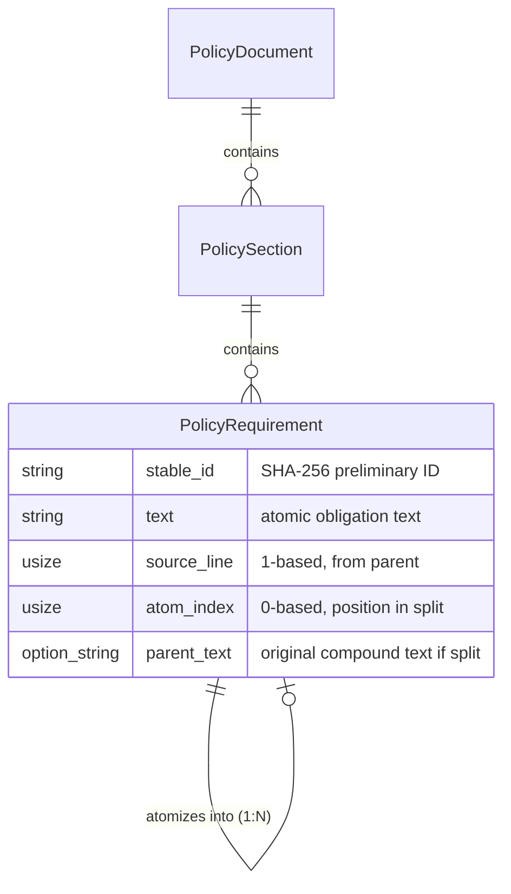

# Implementation Plan: Requirement Atomization

**Branch**: `006-requirement-atomization` | **Date**: 2026-02-11 | **Spec**: [spec.md](./spec.md)
**Input**: Feature specification from `/specs/006-requirement-atomization/spec.md`

## Summary

Implement a regex-based heuristic atomizer that decomposes compound policy statements (e.g., "Systems must enforce MFA and must require complex passwords") into individual atomic requirements suitable for independent OSCAL control mapping. The atomizer operates on the PolicyDocument domain model from WI-5, splits compound statements on conjunction + normative verb boundaries, reconstructs shared subjects for each split clause, and assigns deterministic preliminary IDs using SHA-256 hashing. Conservative splitting ensures correctness: only split when a normative verb follows a conjunction, preserving ambiguous statements as-is. Maximum 50 splits per requirement prevents output cardinality explosion (SEC-5). Replaces compound PolicyRequirements with multiple atomic PolicyRequirements in the domain model, enabling granular compliance tracking downstream.

**Technical Approach** (from AR-006): Option 1 selected — Regex-based heuristic splitting using the `regex` crate with pattern `\b(and|or)\s+(must|shall|should|will)\b`. Deterministic by design (product principle P-3). Rejects NLP/ML approaches to maintain auditability.

## Technical Context

**Language/Version**: Rust (edition 2024, stable 1.93.0)
**Primary Dependencies**: regex (latest stable, new dependency for WI-6), sha2 0.10.x (already a dependency from WI-2), thiserror 2.0.18 (existing error handling)
**Storage**: N/A — in-memory processing only; operates on domain model structs
**Testing**: cargo test (TDD mandatory per constitution principle IV); comprehensive test fixtures for compound/atomic/edge cases
**Target Platform**: Local CLI tool (Linux, macOS, Windows via cross-platform Rust)
**Project Type**: Single Rust project (CLI + library)
**Performance Goals**: Linear time O(n*m) where n = requirements count, m = average statement length; process typical policy documents (<1000 requirements) in <1 second
**Constraints**:
- Conservative splitting only (P-1: Correctness over convenience)
- Deterministic output (P-3: same input = same output)
- Maximum 50 splits per requirement (SEC-5 mitigation)
- Case-sensitive matching (lowercase normative verbs only)
- No ReDoS vulnerability (Rust regex crate guarantees linear-time)

**Scale/Scope**: Single feature within FORGE CLI; affects WI-6 only; no new binaries or modules

## Constitution Check

*GATE: Must pass before Phase 0 research. Re-check after Phase 1 design.*

### Product Principles Compliance

| Principle | Status | Compliance Notes |
|-----------|--------|------------------|
| **P-1: Correctness over convenience** | ✅ PASS | Conservative splitting: only split on clear conjunction + normative verb patterns. Ambiguous statements preserved as-is. 100% accuracy target on test fixtures. |
| **P-2: Traceability is non-negotiable** | ✅ PASS | Source line numbers preserved from parent PolicyRequirement (FR-005). Parent text stored when split occurs (AtomicRequirement.parent_text). |
| **P-3: Deterministic and auditable** | ✅ PASS | SHA-256 hash for preliminary IDs (deterministic). Regex-based splitting (no ML/randomness). Sequential processing in document order. |
| **P-4: CLI-first, composable** | ✅ PASS | Internal library function `atomize_document`; no new CLI subcommands (integrated into existing pipeline). |
| **P-5: Open source, standards-native** | ✅ PASS | MIT-licensed. Prepares requirements for OSCAL control mapping (WI-9+). No proprietary extensions. |

### TDD Mandate (Constitution Principle IV)

| Gate | Status | Evidence |
|------|--------|----------|
| **Tests written before implementation** | ⏳ REQUIRED | Phase 1 will generate test fixtures for all acceptance scenarios (AC-1 through AC-8) and edge cases (EC-1 through EC-10) |
| **User approval of tests** | ⏳ REQUIRED | Test fixtures must be reviewed before implementation begins |
| **Red-Green-Refactor cycle** | ⏳ REQUIRED | Tests must fail initially, then pass after implementation |

**GATE STATUS**: ✅ **PASS** — No principle violations. TDD gates are forward commitments for implementation phase.

## Project Structure

### Documentation (this feature)

```text
specs/006-requirement-atomization/
├── spec.md              # Feature specification (source of truth)
├── plan.md              # This file (/speckit.plan output)
├── research.md          # Phase 0 output (to be generated)
├── data-model.md        # Phase 1 output (to be generated)
├── quickstart.md        # Phase 1 output (to be generated)
├── contracts/           # Phase 1 output (to be generated)
│   └── atomize-api.md   # Function signatures and contracts
└── tasks.md             # Phase 2 output (/speckit.tasks — NOT created by /speckit.plan)
```

### Source Code (repository root)

```text
src/
├── model/              # Domain model (from WI-5: PolicyDocument, PolicyRequirement)
├── parse/              # Existing parsing module
│   └── atomize.rs      # NEW: Atomization logic (this feature)
├── cli/                # Existing CLI entry point
└── lib.rs              # Library root

tests/
├── fixtures/           # NEW: Test policy statements (compound, atomic, edge cases)
│   ├── compound_statements.txt
│   ├── atomic_statements.txt
│   └── edge_cases.txt
├── unit/
│   └── atomize_test.rs # NEW: Unit tests for atomization logic
└── integration/
    └── atomize_integration_test.rs  # NEW: Integration tests for atomize_document
```

**Structure Decision**: Single Rust project (default structure). The atomizer is a new submodule `src/parse/atomize.rs` within the existing `parse` module. No new crates or binaries. Integrates directly into the parsing pipeline after WI-5 domain model construction.

## Complexity Tracking

> **Fill ONLY if Constitution Check has violations that must be justified**

*No violations. Table omitted.*

---

## Phase 0: Outline & Research

### Research Questions

Based on Technical Context, the following are well-specified and require no research:
- ✅ Regex crate usage (already a dependency, pattern specified in AR)
- ✅ SHA-256 for preliminary IDs (sha2 crate already a dependency from WI-2)
- ✅ Domain model structs (defined in WI-5)
- ✅ Conservative splitting algorithm (detailed in AR-006)

### Research Tasks

No unknowns remain. All technical decisions were resolved during clarification session (2026-02-11):
1. Maximum split count: 50 (hardcoded, SEC-5)
2. Hash function: SHA-256 from sha2 crate
3. Case sensitivity: Case-sensitive (lowercase normative verbs only)
4. Logging: DEBUG-level summary metrics (FR-011)
5. ReDoS testing: Formalized as SC-007

**Phase 0 Status**: ✅ **COMPLETE** — No research required. Proceeding directly to Phase 1.

---

## Phase 1: Design & Contracts

### Data Model

**File**: `data-model.md` (to be generated)

#### Entities

From spec.md Key Entities section:

**AtomicRequirement (Logical Concept)**
- Represents a single, indivisible policy obligation
- After atomization, compound PolicyRequirements are replaced by multiple PolicyRequirements, each representing an atomic part
- Not a separate struct; atomized requirements are stored as PolicyRequirement with atomic characteristics

**PolicyRequirement (Existing from WI-5)**
- **Fields**:
  - `stable_id: String` — preliminary ID (SHA-256 hex-encoded) from `preliminary_id(text, source_line, atom_index)`
  - `text: String` — atomic obligation text (reconstructed with shared subject if split)
  - `source_line: usize` — 1-based line number from original document
  - `atom_index: usize` — 0-based position in split (0 for non-split, 0..N for split parts)
  - `parent_text: Option<String>` — original compound text if this requirement was split; None if atomic
- **Validation Rules**:
  - FR-004: `stable_id` must be deterministic (same text + source_line + atom_index = same ID)
  - FR-005: `source_line` must be preserved from parent
  - FR-002: `text` must be complete sentence (shared subject reconstructed if split)
- **State Transitions**: None (immutable once created)

**PolicyDocument (Existing from WI-5)**
- Contains multiple PolicySections with PolicyRequirements
- Atomizer operates on this and returns updated PolicyDocument with compound requirements replaced

#### Relationships



### API Contracts

**File**: `contracts/atomize-api.md` (to be generated)

#### Public API

```rust
/// Result of atomizing a single policy requirement
pub struct AtomizationResult {
    /// The atomic requirements produced (1 if already atomic, N if split)
    pub requirements: Vec<PolicyRequirement>,
    /// Whether the original statement was split
    pub was_split: bool,
    /// The original compound text (if split)
    pub original_text: Option<String>,
}

/// Atomize all requirements in a PolicyDocument.
/// Replaces compound PolicyRequirements with their atomic parts.
///
/// # Errors
/// Returns ForgeError::Parse if regex compilation fails (should not happen with static patterns).
/// Returns ForgeError::Parse if subject extraction fails in a way that cannot be recovered.
pub fn atomize_document(document: PolicyDocument) -> Result<PolicyDocument, ForgeError>;

/// Atomize a single policy requirement.
/// Returns one or more atomic requirement texts.
///
/// # Algorithm
/// 1. Match regex pattern: \b(and|or)\s+(must|shall|should|will)\b
/// 2. If no match: return requirement as-is (atomic)
/// 3. If match found:
///    a. Count number of splits; if > 50, preserve as-is + log warning (FR-010, EC-9)
///    b. Extract shared subject (text before first normative verb)
///    c. Split on conjunction + normative verb boundaries
///    d. Reconstruct each clause with shared subject
///    e. Assign preliminary IDs to each (SHA-256 of text + source_line + atom_index)
/// 4. Return AtomizationResult with all atomic requirements
///
/// # Errors
/// Returns ForgeError::Parse if regex matching fails.
pub fn atomize_requirement(requirement: &PolicyRequirement) -> Result<AtomizationResult, ForgeError>;

/// Generate a preliminary stable ID for an atomic requirement.
/// Uses SHA-256 hash (hex-encoded) of text + source_line + atom_index.
/// Will be replaced by UUID v5 in WI-7.
///
/// # Format
/// Input: text + "|" + source_line.to_string() + "|" + atom_index.to_string()
/// Output: 64-character hex-encoded SHA-256 hash
///
/// # Examples
/// ```
/// let id = preliminary_id("Systems must enforce MFA", 42, 0);
/// assert_eq!(id.len(), 64); // SHA-256 hex = 32 bytes * 2 hex chars/byte
///
/// // Determinism test
/// let id1 = preliminary_id("text", 10, 0);
/// let id2 = preliminary_id("text", 10, 0);
/// assert_eq!(id1, id2);
/// ```
pub fn preliminary_id(text: &str, source_line: usize, atom_index: usize) -> String;
```

#### Internal Helpers (Private)

```rust
/// Compile the regex pattern for conjunction + normative verb detection.
/// Pattern: \b(and|or)\s+(must|shall|should|will)\b
/// Case-sensitive (lowercase normative verbs only).
///
/// This function should be called once (lazy_static or similar) to compile the pattern.
fn build_split_pattern() -> Regex;

/// Extract the shared subject from a compound statement.
/// Subject = text before the first normative verb occurrence.
///
/// # Returns
/// - Some(subject) if a clear subject is found
/// - None if subject extraction fails (AR error handling: preserve original text as-is, log warning)
fn extract_subject(text: &str, first_verb_pos: usize) -> Option<String>;

/// Reconstruct a complete sentence by prepending the shared subject to a clause fragment.
/// Handles cases where the clause already has its own subject (no duplication).
///
/// # Examples
/// - shared_subject="Systems", clause="enforce MFA" → "Systems enforce MFA"
/// - shared_subject="Systems", clause="Systems require passwords" → "Systems require passwords" (no duplication)
fn reconstruct_clause(shared_subject: &str, clause: &str) -> String;
```

### Quickstart Guide

**File**: `quickstart.md` (to be generated)

#### For Developers

1. **Read the domain model**: Understand `PolicyRequirement` struct from WI-5 (in `src/model/`)
2. **Review the algorithm**: Read AR-006 for regex pattern and subject reconstruction logic
3. **Study test fixtures**: See `tests/fixtures/` for examples of compound, atomic, and edge cases
4. **TDD workflow**:
   - Start with `tests/unit/atomize_test.rs`
   - Write tests for AC-1 through AC-8 (acceptance criteria)
   - Write tests for EC-1 through EC-10 (edge cases)
   - All tests must fail initially (no implementation yet)
   - Get user approval on test fixtures
   - Implement `src/parse/atomize.rs` following AR guardrails
   - Run `cargo test` — tests should now pass (green)
   - Refactor if needed

5. **Key constraints** (from AR Implementation Guardrails):
   - DO NOT split on conjunctions without a following normative verb (EC-1, EC-5)
   - DO NOT use NLP, ML, or any non-deterministic processing
   - DO NOT modify the text of atomic (non-compound) statements
   - DO NOT generate UUID v5 identifiers (use preliminary SHA-256 IDs only)
   - MUST reconstruct shared subject for each split clause (FR-002)
   - MUST preserve source line numbers (FR-005)
   - MUST test regex against adversarial input (SC-007, SEC-4)

6. **Security requirements** (from SEC-006):
   - SEC-1: Use Rust `regex` crate (linear-time guarantee)
   - SEC-4: Test with 10KB+ repetitive strings, unicode edge cases
   - SEC-5: Enforce maximum split count of 50 per requirement
   - SEC-7: Atomizer must be a pure function (no side effects, no global state)
   - SEC-9: Atomic statements pass through unchanged (no text modification)

#### Integration Points

- **Input**: `PolicyDocument` from WI-5 (after domain model construction)
- **Output**: Updated `PolicyDocument` with atomized requirements
- **Next Stage**: WI-7 (UUID generation) consumes atomized requirements and replaces preliminary IDs with deterministic UUID v5

---

## Phase 2: Task Generation

**Note**: Task generation is handled by `/speckit.tasks` command (not part of `/speckit.plan`).

See `tasks.md` (to be generated by `/speckit.tasks`).

---

## Validation Checklist

- [x] All Must Have requirements (FR-001 through FR-006, FR-010) are addressed in design
- [x] Should Have requirements (FR-007 through FR-009, FR-011) are noted
- [x] Architecture decisions from AR-006 are incorporated (Option 1: Regex-based)
- [x] Security requirements from SEC-006 are incorporated (SEC-1, SEC-4, SEC-5, SEC-7, SEC-9)
- [x] Implementation guardrails from AR-006 are documented in contracts
- [x] Data model traces to Key Entities in spec.md
- [x] API contracts include all public functions from Interface Contract in spec.md
- [x] TDD workflow is specified (tests before implementation)
- [x] Conservative splitting principle (P-1) is enforced in algorithm
- [x] Determinism (P-3) is ensured via SHA-256 and sequential processing
- [x] Traceability (P-2) is maintained via source_line and parent_text fields

---

## Next Steps

1. **Immediate**: Run `/speckit.tasks` to generate `tasks.md` with dependency-ordered implementation tasks
2. **Before implementation**: Review and approve test fixtures (TDD mandate)
3. **Implementation**: Follow TDD cycle (red → green → refactor)
4. **Validation**: All tests pass, mutation testing (cargo-mutants), clippy clean, no warnings

**Plan Status**: ✅ **READY FOR TASKS**
