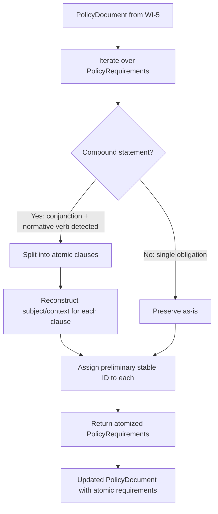

# Feature Specification: Requirement Atomization

**Feature Branch**: `006-requirement-atomization`
**Created**: 2026-02-11
**Status**: Draft
**Input**: Read docs/PRD/006-prd-requirement-atomization.md as the source of truth for this feature's requirements. This work item breaks extracted clauses into atomic requirement statements — individual, testable control requirements suitable for OSCAL control parts.

## Clarifications

### Session 2026-02-11

- Q: Should we implement the SEC review's recommendation (F1, SEC-5) to add a maximum split count per requirement to prevent output cardinality explosion? → A: Implement with hardcoded max of 50 splits per requirement; preserve as-is when exceeded + log warning
- Q: Which hash function should be used to generate preliminary stable IDs? → A: SHA-256 hash from sha2 crate (already a dependency); hex-encoded output
- Q: Should the regex pattern match normative verbs case-insensitively to handle variations like "MUST" or "Must"? → A: Case-sensitive only (lowercase "must", "shall", "should", "will" as currently specified)
- Q: Should we formalize the DEBUG-level logging metrics mentioned in AR-006 (requirements processed, split count, preserved count) as a functional requirement in the spec? → A: Yes, add as SHOULD requirement
- Q: Should adversarial input testing for ReDoS resistance (SEC-4, Finding F2) be added as a formal acceptance criterion in the PRD? → A: Yes, add as acceptance criterion for security verification

## User Scenarios & Testing *(mandatory)*

### User Story 1 - Split Compound Policy Statement (Priority: P1)

A policy document contains compound statements that join multiple obligations with conjunctions and normative verbs. The system must split these into individual atomic requirements so that each obligation becomes a separate OSCAL control that can be independently assessed.

**Why this priority**: Atomization directly implements Parent PRD M-2 and is on the critical path. Without it, compound statements produce ambiguous controls that cannot be granularly assessed. This is the core value proposition of this feature.

**Independent Test**: Pass a compound policy statement through the atomizer and verify it produces the correct number of atomic requirements with accurate text. Can be fully tested with fixtures containing compound statements like "Systems must enforce MFA and must require complex passwords".

**Acceptance Scenarios**:

1. **Given** the statement "Systems must enforce MFA and must require complex passwords", **When** atomizing, **Then** two atomic requirements are produced: "Systems must enforce MFA" and "Systems must require complex passwords"
2. **Given** the statement "The organization shall review access logs and shall revoke inactive accounts within 30 days", **When** atomizing, **Then** two atomic requirements are produced, each preserving its full clause text with shared subject
3. **Given** the statement "All employees must complete security training and must acknowledge the acceptable use policy or must request a waiver", **When** atomizing, **Then** three atomic requirements are produced, one per normative verb clause

---

### User Story 2 - Preserve Atomic Statements (Priority: P1)

A policy document contains statements that are already atomic (a single obligation per statement). The system must preserve these unchanged to avoid corrupting simple requirements.

**Why this priority**: Per Parent PRD EC-2, atomic statements must be preserved as-is. The atomizer must not corrupt or unnecessarily modify single-obligation statements. This ensures correctness and maintains trust in the tool.

**Independent Test**: Pass an atomic policy statement through the atomizer and verify it produces exactly one requirement with unmodified text. Can be fully tested with fixtures containing simple statements like "All systems must enforce MFA".

**Acceptance Scenarios**:

1. **Given** the statement "All systems must enforce MFA", **When** atomizing, **Then** exactly one atomic requirement is produced with the original text unchanged
2. **Given** the statement "Passwords must be at least 12 characters", **When** atomizing, **Then** exactly one atomic requirement is produced with the original text unchanged

---

### User Story 3 - Assign Preliminary IDs to Atomic Requirements (Priority: P2)

After atomization, each resulting atomic requirement needs a preliminary identifier for downstream processing. This enables traceability through the pipeline before deterministic UUIDs are generated in WI-7.

**Why this priority**: Preliminary IDs establish the identity of each atomic requirement before WI-7 generates deterministic UUIDs. They enable traceability through the pipeline and are needed by WI-7 and WI-9.

**Independent Test**: Atomize a compound statement and verify each resulting requirement has a unique, non-empty preliminary ID. Can be fully tested by atomizing the same statement twice and comparing IDs for determinism.

**Acceptance Scenarios**:

1. **Given** a compound statement split into 2 atomic requirements, **When** examining the results, **Then** each requirement has a unique, non-empty preliminary ID
2. **Given** the same compound statement atomized twice, **When** comparing preliminary IDs, **Then** the IDs are identical across runs (deterministic)

---

### Edge Cases

- **EC-1**: When a statement contains "and" but no normative verb after the conjunction (e.g., "must encrypt and store data securely"), then the statement is preserved as-is (no split)
- **EC-2**: When a statement uses "or" as a conjunction with normative verbs (e.g., "must implement MFA or must use certificate-based authentication"), then the statement is split into separate atomic requirements
- **EC-3**: When a statement contains three or more conjunction-normative verb pairs (e.g., "must X and must Y and must Z"), then all clauses are split into separate atomic requirements
- **EC-4**: When a compound statement has a shared subject (e.g., "The IT department must X and must Y"), then each atomic requirement reconstructs the full sentence with the shared subject
- **EC-5**: When a statement contains "and" in a non-splitting context (e.g., "must implement logging and monitoring"), then the statement is preserved as-is because no normative verb follows the conjunction
- **EC-6**: When a statement uses "shall" as the normative verb (e.g., "shall X and shall Y"), then splitting works the same as with "must"
- **EC-7**: When a requirement text is empty or whitespace-only, then it is preserved as-is without error
- **EC-8**: When a PolicyDocument has zero requirements, then atomize_document() returns the document unchanged
- **EC-9**: When a compound statement would produce more than 50 atomic requirements, then the statement is preserved as-is (no split) and a warning is logged
- **EC-10**: When a statement contains uppercase or mixed-case normative verbs (e.g., "MUST enforce MFA and MUST require passwords"), then the statement is preserved as-is (no split) because the pattern matcher is case-sensitive

## Requirements *(mandatory)*

### Functional Requirements

- **FR-001** (M-1): The atomizer MUST detect compound statements containing conjunctions ("and", "or") paired with normative verbs ("must", "shall", "should", "will") and split them into individual atomic requirements. *(Traces to: Parent PRD M-2)*
- **FR-002** (M-2): Each atomic requirement produced by splitting MUST contain the complete text of its individual obligation, including any shared subject or context from the original compound statement. *(Traces to: Parent PRD M-2)*
- **FR-003** (M-3): Single atomic statements (those without detectable compound patterns) MUST pass through the atomizer unchanged. *(Traces to: Parent PRD EC-2)*
- **FR-004** (M-4): Each atomic requirement MUST be assigned a preliminary stable ID that is deterministic (same input produces same ID). *(Traces to: Parent PRD M-2, M-8)*
- **FR-005** (M-5): The atomizer MUST preserve source line numbers from the original PolicyRequirement on each resulting atomic requirement. *(Traces to: Parent PRD M-10)*
- **FR-006** (M-6): The atomizer MUST operate on a PolicyDocument and return an updated PolicyDocument with compound requirements replaced by their atomic parts. *(Traces to: Parent PRD M-2)*
- **FR-007** (S-1): The atomizer SHOULD handle statements with more than two conjunctions (e.g., "must X and must Y and must Z") producing the correct number of atomic requirements
- **FR-008** (S-2): The atomizer SHOULD handle mixed conjunctions (e.g., "must X and must Y or must Z") by splitting on each conjunction-normative verb pair
- **FR-009** (S-3): The atomizer SHOULD log a warning when it encounters a conjunction without a subsequent normative verb, indicating a potential compound statement that could not be confidently split
- **FR-010** (M-7): The atomizer MUST enforce a maximum split count of 50 atomic requirements per compound statement; when exceeded, the statement MUST be preserved as-is and a warning MUST be logged. *(Traces to: SEC-5, Security Finding F1)*
- **FR-011** (S-4): The atomizer SHOULD log summary metrics at DEBUG level including: total requirements processed, number split, number preserved as-is. *(Traces to: AR-006 Observability)*
- **FR-012** (C-1): The atomizer COULD support configurable normative verb lists to accommodate domain-specific policy language
- **FR-013** (C-2): The atomizer COULD produce an atomization report summarizing how many statements were split and how many were preserved as-is

### Key Entities *(include if feature involves data)*

- **AtomicRequirement**: Represents a single, indivisible policy obligation that can be independently assessed and mapped to one OSCAL control. Contains preliminary_id (SHA-256 hash, hex-encoded), text (atomic obligation text), source_line (1-based, from parent), atom_index (0-based, position in split), and parent_text (original compound text, if split)
- **PolicyRequirement**: Existing domain model struct (from WI-5) that represents a policy requirement. After atomization, compound PolicyRequirements are replaced by multiple PolicyRequirements, each with its own preliminary stable_id
- **PolicyDocument**: Existing domain model struct (from WI-5) that contains multiple PolicySections with PolicyRequirements. The atomizer operates on this and returns an updated PolicyDocument

## Success Criteria *(mandatory)*

### Measurable Outcomes

- **SC-001**: Compound statements are correctly split into atomic parts with 100% accuracy on test fixtures (no false splits, no missed splits on clear patterns)
- **SC-002**: Atomic statements pass through unchanged with 100% accuracy (no modification to already-atomic statements)
- **SC-003**: Split requirements retain meaningful context with 100% accuracy on test fixtures (each atomic requirement is a complete sentence with shared subject reconstructed)
- **SC-004**: Same input produces identical preliminary IDs across runs with 100% consistency (deterministic ID generation)
- **SC-005**: The atomizer processes requirements in linear time O(n) where n is the number of requirements, with O(m) processing per statement where m is statement length
- **SC-006**: Compliance engineers can assess each atomized requirement independently, resulting in more granular compliance tracking
- **SC-007**: Regex patterns resist ReDoS attacks, validated through adversarial input testing (10KB+ repetitive strings, unicode edge cases) with no performance degradation. *(Traces to: SEC-4, Security Finding F2)*

## Dependencies *(mandatory)*

- **Requires**: [005-prd-domain-model](../../docs/PRD/005-prd-domain-model.md) — provides PolicyDocument, PolicySection, PolicyRequirement structs
- **Blocks**: [007-prd-uuid-generation](../../docs/PRD/007-prd-uuid-generation.md) — UUID generation depends on atomized requirements being available
- **Parallel**: [008-prd-citation-extraction](../../docs/PRD/008-prd-citation-extraction.md) — citation extraction can proceed concurrently

## Assumptions *(mandatory)*

- **A-1**: Compound policy statements follow recognizable syntactic patterns: conjunctions ("and", "or") paired with normative verbs ("must", "shall", "should", "will")
- **A-2**: The domain model (WI-5) provides PolicyRequirement structs with text content available for splitting
- **A-3**: Heuristic splitting is sufficient for the majority of well-structured policy documents; ML-based splitting is not needed in this phase
- **A-4**: Preliminary stable IDs can be derived from content (e.g., hash-based) without requiring the full UUID v5 scheme from WI-7

## Out of Scope *(mandatory)*

- **W-1**: Deterministic UUID v5 generation — *Reason: Deferred to WI-7 (007-prd-uuid-generation); M-4 uses preliminary content-based IDs only*
- **W-2**: ML/NLP-based semantic splitting — *Reason: Deferred per product principle P-3 (deterministic and auditable); heuristic splitting only in this phase*
- **W-3**: Normative vs advisory classification ("must" vs "should") — *Reason: Deferred to WI-33; the atomizer detects normative verbs for splitting but does not classify modality*
- **W-4**: User-interactive review of splits — *Reason: Deferred per roadmap risk RR-2 contingency; fully automatic in this phase*

## Risks *(optional)*

| Risk | Likelihood | Impact | Mitigation |
|------|------------|--------|------------|
| Heuristic splitting incorrectly splits on "and"/"or" that are not joining separate obligations (e.g., "must encrypt and store data") | Medium | Medium | Conservative splitting: only split when a normative verb follows the conjunction; err on the side of not splitting |
| Policy statements use complex sentence structures that resist heuristic decomposition (subordinate clauses, parentheticals) | Medium | Low | Preserve complex statements as-is when the pattern is ambiguous; document limitations |
| Splitting changes the semantic meaning of a requirement (e.g., shared subject or object is lost) | Medium | Medium | Carry forward the subject/context from the original statement to each split requirement; validate with test fixtures |
| Output cardinality explosion from pathological input with many conjunction-verb pairs | Low | Low | Hardcoded maximum split count of 50 per requirement; preserve as-is when exceeded with warning (FR-010, EC-9) |

## Design Notes *(optional)*

### Flow Diagram



### Interface Contract

```rust
/// Result of atomizing a single policy requirement
pub struct AtomizationResult {
    /// The atomic requirements produced (1 if already atomic, N if split)
    pub requirements: Vec<PolicyRequirement>,
    /// Whether the original statement was split
    pub was_split: bool,
    /// The original compound text (if split)
    pub original_text: Option<String>,
}

/// Atomize all requirements in a PolicyDocument
/// Replaces compound PolicyRequirements with their atomic parts
pub fn atomize_document(document: PolicyDocument) -> Result<PolicyDocument, ForgeError>;

/// Atomize a single policy requirement text
/// Returns one or more atomic requirement texts
pub fn atomize_requirement(requirement: &PolicyRequirement) -> Result<AtomizationResult, ForgeError>;

/// Generate a preliminary stable ID for an atomic requirement
/// Uses SHA-256 hash (hex-encoded) of text + source_line + atom_index
/// Will be replaced by UUID v5 in WI-7
pub fn preliminary_id(text: &str, source_line: usize, atom_index: usize) -> String;
```

### Implementation Approach

Implement the atomizer in the `parse` module (or a dedicated `atomize` submodule). The core logic should:

1. **Detect compound patterns**: Use case-sensitive regex to find conjunctions ("and", "or") preceded or followed by lowercase normative verbs ("must", "shall", "should", "will"). The key pattern is: `<text> <normative-verb> <obligation> <conjunction> <normative-verb> <obligation>`. Pattern: `\b(and|or)\s+(must|shall|should|will)\b`
2. **Split on conjunction + normative verb boundaries**: When "and must", "and shall", "or must", "or shall" (and similar) are detected, split the statement at those boundaries.
3. **Check split count**: If the number of resulting atomic requirements would exceed 50, preserve the compound statement as-is and log a warning (FR-010, EC-9).
4. **Reconstruct shared subject**: If the clause before the first normative verb is a subject phrase (e.g., "Systems", "The organization"), prepend it to each split clause that lacks its own subject.
5. **Assign preliminary IDs**: Compute a SHA-256 hash (hex-encoded) from the atomic text, source line, and atom index using the sha2 crate.
6. **Update the domain model**: Replace each compound PolicyRequirement in the PolicyDocument with the resulting atomic PolicyRequirements.

### Anti-patterns to Avoid

- Splitting on every occurrence of "and"/"or" without checking for an accompanying normative verb — this would incorrectly split phrases like "logging and monitoring"
- Modifying atomic statements that pass through — the atomizer must be a no-op for non-compound statements
- Using non-deterministic processing (e.g., thread-dependent ordering) — output must be identical across runs per P-3
- Over-engineering the splitter with NLP features that violate the heuristic-only scope of this WI

## Glossary *(optional)*

| Term | Definition |
|------|------------|
| Atomization | The process of splitting compound policy statements into individual, independently addressable requirements |
| Compound Statement | A policy statement containing multiple obligations joined by conjunctions (e.g., "must X and must Y") |
| Atomic Requirement | A single, indivisible policy obligation that can be independently assessed and mapped to one OSCAL control |
| Normative Verb | A verb indicating obligation level in policy language: "must", "shall" (mandatory), "should" (recommended), "will" (intent) |
| Conjunction | A connecting word ("and", "or") that joins clauses within a compound statement |
| Preliminary Stable ID | A temporary identifier assigned to each atomic requirement before deterministic UUID generation in WI-7 |
| Heuristic Splitting | Rule-based text splitting using syntactic patterns rather than semantic understanding |
