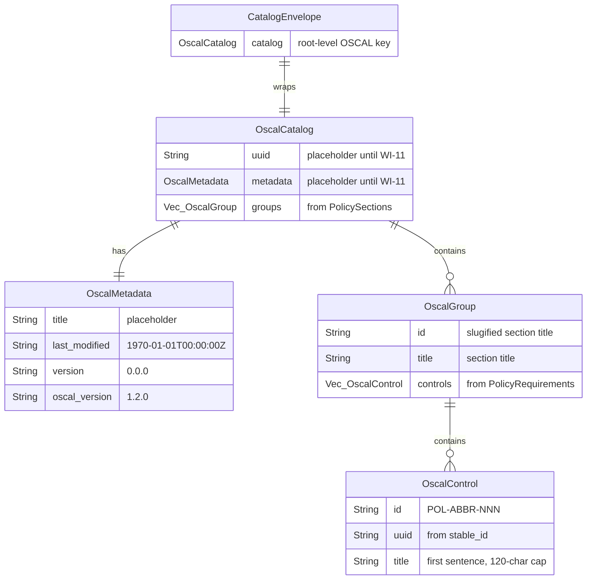

# Data Model: OSCAL Catalog Groups and Controls

**Feature**: 009-catalog-groups-controls
**Date**: 2026-02-11

## Entity Overview

## Mapping: Domain Model → OSCAL Catalog

| Domain Model Entity | Domain Model Field | OSCAL Entity | OSCAL Field | Transformation |
|---------------------|--------------------|--------------|-------------|----------------|
| `PolicyDocument` | — | `OscalCatalog` | — | Top-level container |
| `PolicyDocument.sections` | each `PolicySection` | `OscalCatalog.groups` | each `OscalGroup` | One group per top-level section |
| `PolicySection.title` | `String` | `OscalGroup.title` | `String` | Direct copy |
| `PolicySection.title` | `String` | `OscalGroup.id` | `String` | `generate_group_id()` — slugified |
| `PolicySection.requirements` + children | `Vec<PolicyRequirement>` | `OscalGroup.controls` | `Vec<OscalControl>` | Flat: recursively collect all requirements |
| `PolicyRequirement.stable_id` | `Option<String>` | `OscalControl.uuid` | `String` | Unwrap or error (SEC-1) |
| `PolicyRequirement.text` | `String` | `OscalControl.title` | `String` | `derive_control_title()` — first sentence, 120-char cap |
| Section context + requirement index | — | `OscalControl.id` | `String` | `generate_control_id()` — `POL-{ABBR}-{NNN}` |

## Struct Definitions

### CatalogEnvelope

JSON serialization wrapper providing the OSCAL root key.

| Field | Type | Serde Attribute | Description |
|-------|------|-----------------|-------------|
| `catalog` | `OscalCatalog` | — | The OSCAL Catalog |

### OscalCatalog

Root OSCAL Catalog structure.

| Field | Type | Serde Attribute | Description |
|-------|------|-----------------|-------------|
| `uuid` | `String` | — | Placeholder: `"00000000-0000-0000-0000-000000000000"` (WI-11) |
| `metadata` | `OscalMetadata` | — | Placeholder metadata (WI-11) |
| `groups` | `Vec<OscalGroup>` | `skip_serializing_if = "Vec::is_empty"` | Groups from PolicySections |

### OscalMetadata

Placeholder metadata (fully implemented by WI-11).

| Field | Type | Serde Attribute | Description |
|-------|------|-----------------|-------------|
| `title` | `String` | — | Placeholder: `"placeholder"` |
| `last_modified` | `String` | `rename = "last-modified"` | Placeholder: `"1970-01-01T00:00:00Z"` |
| `version` | `String` | — | Placeholder: `"0.0.0"` |
| `oscal_version` | `String` | `rename = "oscal-version"` | Fixed: `"1.2.0"` |

### OscalGroup

An OSCAL group mapped from a PolicySection.

| Field | Type | Serde Attribute | Description |
|-------|------|-----------------|-------------|
| `id` | `String` | — | Slugified section title (e.g., `access-control`) |
| `title` | `String` | — | Section title verbatim |
| `controls` | `Vec<OscalControl>` | `skip_serializing_if = "Vec::is_empty"` | Controls from requirements |

### OscalControl

An OSCAL control mapped from a PolicyRequirement.

| Field | Type | Serde Attribute | Description |
|-------|------|-----------------|-------------|
| `id` | `String` | — | `POL-{ABBR}-{NNN}` pattern |
| `uuid` | `String` | — | From `PolicyRequirement.stable_id` |
| `title` | `String` | — | First sentence, capped at 120 chars |

## Algorithms

### generate_group_id(section_title: &str) → String

1. Lowercase the title
2. Replace any character that is not alphanumeric or hyphen with a hyphen
3. Collapse consecutive hyphens into single hyphen
4. Trim leading and trailing hyphens
5. If result is empty, return an empty string

> **Note**: `generate_group_id` does not handle the `"group-{index}"` fallback itself because it has no index parameter. The fallback is applied by `resolve_group_id` (called from `build_catalog`), which substitutes `"group-{index}"` when `generate_group_id` returns an empty string.

**Examples**:
- `"Access Control Policies"` → `"access-control-policies"`
- `"Data Protection & Privacy"` → `"data-protection-privacy"`
- `"3.1 — Incident Response"` → `"3-1-incident-response"`

### generate_section_abbreviation(section_title: &str) → String

1. Split title into words (whitespace boundary)
2. Remove stop words: `and`, `the`, `of`, `for`, `in`, `to`, `a`, `an`
3. Take first character of each remaining word
4. Uppercase all characters
5. If no characters remain, use first 2 characters of the title (uppercased)

**Stop words list**: `["a", "an", "and", "the", "of", "for", "in", "to"]`

**Examples**:
- `"Access Control"` → `"AC"`
- `"Incident Response and Recovery"` → `"IRR"`
- `"Data Protection"` → `"DP"`
- `"Physical and Environmental Security"` → `"PES"`

### Abbreviation Collision Resolution

Track abbreviations in a `HashMap<String, usize>`:
1. Generate base abbreviation for each section
2. If abbreviation already used: increment counter and append (e.g., `AC` → `AC2`)
3. Record the final abbreviation in the map

### generate_control_id(abbreviation: &str, requirement_index: usize, prefix: &str) → String

Format: `{prefix}-{abbreviation}-{NNN}`
- `requirement_index` is 0-based internally, displayed as 1-based
- Zero-pad to 3 digits minimum; extend naturally if >999 (e.g., `1000`)

**Examples**:
- `generate_control_id("AC", 0, "POL")` → `"POL-AC-001"`
- `generate_control_id("AC", 999, "POL")` → `"POL-AC-1000"`

### derive_control_title(requirement_text: &str) → String

1. Find first occurrence of `.`, `!`, or `?` in the text
2. Extract up to and including that character (the first sentence)
3. If no sentence-ending punctuation found, use full text
4. Trim whitespace
5. If length > 120 characters, truncate to 120 and append `...`

**Examples**:
- `"Systems shall require MFA. Additional controls apply."` → `"Systems shall require MFA."`
- `"All access must be logged"` → `"All access must be logged"` (no period, use full text)
- Very long first sentence (>120 chars) → first 120 chars + `"..."`

## Validation Rules

| Rule | Source | Error |
|------|--------|-------|
| `PolicyRequirement.stable_id` must be `Some` | SEC-1, M-6, EC-5 | `ForgeError::CatalogBuild("Requirement missing stable_id: ...")` |
| All control IDs must be unique across Catalog | M-8, SEC-2 | `ForgeError::CatalogBuild("Duplicate control ID: ...")` |
| Group IDs must be unique across Catalog | S-1 | Resolve by appending numeric suffix |
| Section title special characters must be safely slugified | SEC-3, EC-4 | Handled by `generate_group_id()` |
