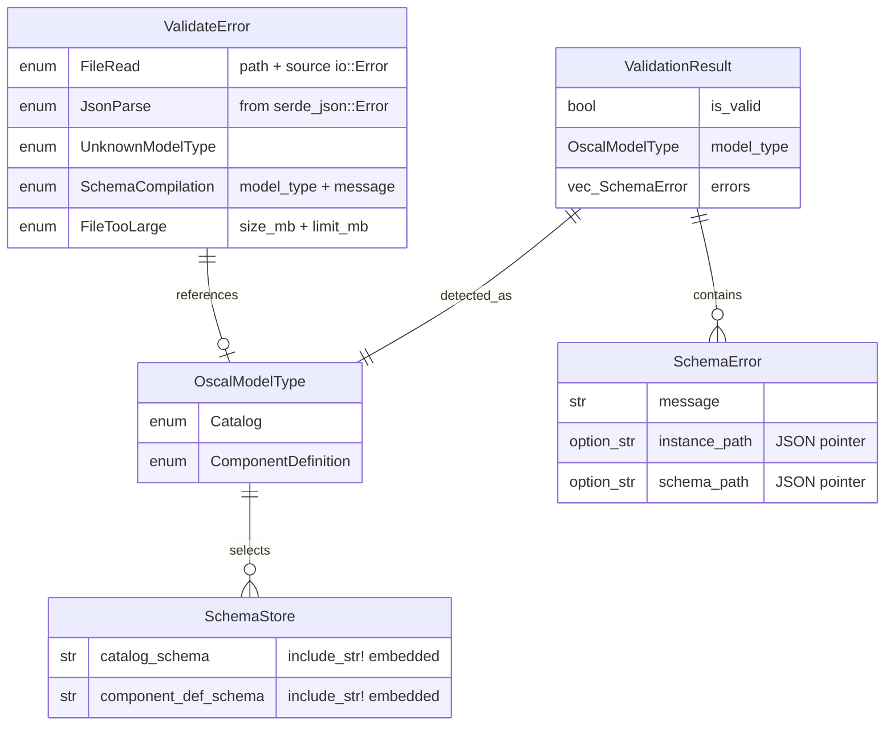

# Data Model: 019-schema-validation

**Date**: 2026-02-13 | **Branch**: `019-schema-validation`

## Entity Overview



## Entity Details

### OscalModelType

**Purpose**: Identifies which OSCAL model an artifact represents, determining which schema to validate against.

| Variant | Top-Level JSON Key | Schema File |
|---------|-------------------|-------------|
| `Catalog` | `"catalog"` | `oscal_catalog_schema.json` |
| `ComponentDefinition` | `"component-definition"` | `oscal_component-definition_schema.json` |

**Validation rules**: Exactly one of the known top-level keys must be present. If none match, `ValidateError::UnknownModelType` is returned.

**Derivations**: `Debug`, `Clone`, `Copy`, `PartialEq`, `Eq`

### ValidationResult

**Purpose**: Outcome of schema validation — carries the boolean result plus all errors.

| Field | Type | Description |
|-------|------|-------------|
| `is_valid` | `bool` | `true` if zero errors; derived from `errors.is_empty()` |
| `model_type` | `OscalModelType` | The detected (or overridden) model type |
| `errors` | `Vec<SchemaError>` | All schema violations (empty if valid) |

**Invariant**: `is_valid == errors.is_empty()` — always consistent.

### SchemaError

**Purpose**: A single schema validation error with location context.

| Field | Type | Description |
|-------|------|-------------|
| `message` | `String` | Human-readable error description from jsonschema crate |
| `instance_path` | `Option<String>` | JSON pointer path to the failing element (e.g., `/catalog/metadata/title`) |
| `schema_path` | `Option<String>` | JSON pointer path within the schema that was violated |

**Construction**: Built from `jsonschema::ValidationError` fields:
```rust
SchemaError {
    message: format!("{error}"),
    instance_path: Some(error.instance_path.to_string()),
    schema_path: Some(error.schema_path.to_string()),
}
```

### ValidateError

**Purpose**: Error enum for all validation operation failures (distinct from `SchemaError` which represents a schema violation in a valid JSON document).

| Variant | When | Fields |
|---------|------|--------|
| `FileRead` | File cannot be read (not found, permission denied) | `path: PathBuf`, `source: io::Error` |
| `JsonParse` | File content is not valid JSON | From `serde_json::Error` |
| `UnknownModelType` | No recognized OSCAL top-level key | None |
| `SchemaCompilation` | Embedded schema fails to compile (should be impossible in practice) | `model_type: String`, `message: String` |
| `FileTooLarge` | File exceeds 50MB size limit | `size_mb: f64`, `limit_mb: u64` |

**Derivations**: `Debug`, `thiserror::Error`

### ForgeError Extension

| Variant | When | Fields |
|---------|------|--------|
| `SchemaValidation` | Auto-validation in `forge convert` detects schema violations | `String` (formatted error summary) |

## Data Flow

```
User Input (JSON file)
    │
    ▼
check_file_size() ──→ FileTooLarge error
    │
    ▼
std::fs::read_to_string() ──→ FileRead error
    │
    ▼
serde_json::from_str() ──→ JsonParse error
    │
    ▼
detect_model_type() ──→ UnknownModelType error
    │
    ▼
load_schema() ──→ (embedded, always succeeds)
    │
    ▼
jsonschema::validator_for() ──→ SchemaCompilation error
    │
    ▼
validator.iter_errors() ──→ Vec<SchemaError>
    │
    ▼
ValidationResult { is_valid, model_type, errors }
```
