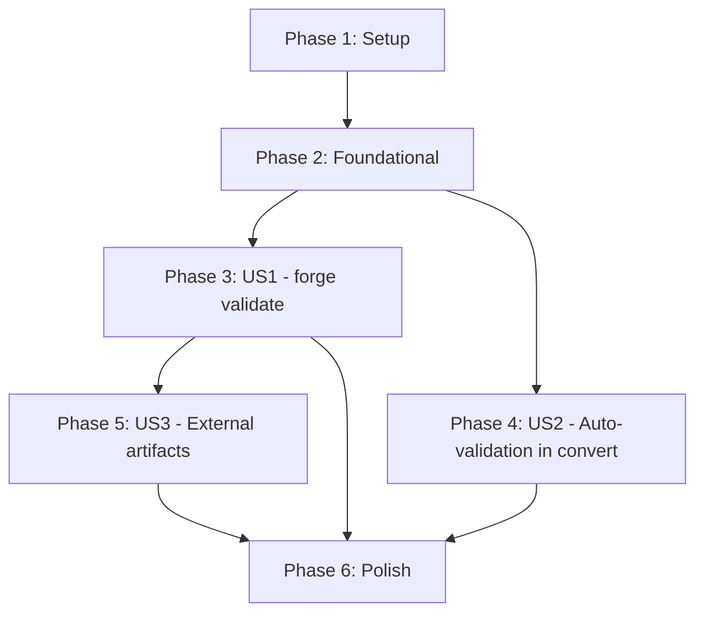

# Tasks: 019-schema-validation

**Input**: Design documents from `/specs/019-schema-validation/`
**Prerequisites**: plan.md, PRD, AR, SEC, research.md, data-model.md, contracts/

**Tests**: Included — TDD mandatory per constitution principle IV.

**Organization**: Tasks grouped by user story to enable independent implementation and testing.

## Format: `[ID] [P?] [Story] Description`

- **[P]**: Can run in parallel (different files, no dependencies)
- **[Story]**: Which user story this task belongs to (e.g., US1, US2, US3)
- Include exact file paths in descriptions

---

## Phase 1: Setup (Shared Infrastructure)

**Purpose**: Download schemas, add dependency, extend error types

- [x] T001 Download OSCAL v1.2.0 Catalog JSON schema from NIST GitHub release to `schemas/oscal_catalog_schema.json` — pin to release tag `v1.2.0` (SEC-9, M-2)
- [x] T002 [P] Download OSCAL v1.2.0 Component Definition JSON schema from NIST GitHub release to `schemas/oscal_component_schema.json` — pin to release tag `v1.2.0` (SEC-9, M-2)
- [x] T003 Add `jsonschema` crate at latest stable to `Cargo.toml` — run `cargo add jsonschema` then `cargo audit` to verify no advisories (M-7, constitution XI)
- [x] T004 Add `SchemaValidation(String)` variant to `ForgeError` enum in `src/error.rs` with display message `"Schema validation failed: {0}"` and add test for new variant

**Checkpoint**: Schemas embedded, dependency added, error type extended. `cargo build` succeeds.

---

## Phase 2: Foundational (Validation Module Core — TDD)

**Purpose**: Core validation types and functions that ALL user stories depend on

**CRITICAL**: No user story work can begin until this phase is complete

### Types & Structure

- [x] T005 Define `OscalModelType` enum (Catalog, ComponentDefinition) with `Debug, Clone, Copy, PartialEq, Eq` derives in `src/validate/mod.rs`
- [x] T006 [P] Define `ValidationResult` struct (is_valid: bool, model_type: OscalModelType, errors: Vec\<SchemaError\>) in `src/validate/mod.rs`
- [x] T007 [P] Define `SchemaError` struct (message: String, instance_path: Option\<String\>, schema_path: Option\<String\>) in `src/validate/mod.rs`
- [x] T008 [P] Define `ValidateError` thiserror enum with variants FileRead, JsonParse, UnknownModelType, SchemaCompilation, FileTooLarge in `src/validate/mod.rs` (SEC-7)
- [x] T009 Re-export validation public types from `src/lib.rs` — add `pub use validate::{OscalModelType, ValidationResult, SchemaError, ValidateError, detect_model_type, load_schema, validate_artifact};`

### detect_model_type() — TDD

- [x] T010 Write unit tests for `detect_model_type()` in `src/validate/mod.rs` — test cases: (1) JSON with top-level `"catalog"` key returns `OscalModelType::Catalog`, (2) JSON with top-level `"component-definition"` key returns `OscalModelType::ComponentDefinition`, (3) JSON with neither key returns `Err(ValidateError::UnknownModelType)`, (4) empty JSON object returns UnknownModelType — tests MUST FAIL (RED)
- [x] T011 Implement `detect_model_type(json: &Value) -> Result<OscalModelType, ValidateError>` in `src/validate/mod.rs` — inspect `json.get("catalog")` and `json.get("component-definition")` — tests MUST PASS (GREEN) (M-3)

### load_schema() — TDD

- [x] T012 Write unit tests for `load_schema()` in `src/validate/mod.rs` — test cases: (1) `load_schema(Catalog)` returns parseable JSON Value, (2) `load_schema(ComponentDefinition)` returns parseable JSON Value, (3) both schemas contain `"$schema"` key — tests MUST FAIL (RED)
- [x] T013 Implement `load_schema(model_type: OscalModelType) -> Result<Value, ValidateError>` in `src/validate/mod.rs` — use `include_str!("../../schemas/oscal_catalog_schema.json")` and `include_str!("../../schemas/oscal_component_schema.json")` with `serde_json::from_str` — tests MUST PASS (GREEN) (M-2)

### validate_artifact() — TDD

- [x] T014 Write unit tests for `validate_artifact()` in `src/validate/mod.rs` — test cases: (1) minimal valid Catalog JSON returns `is_valid: true` with empty errors, (2) Catalog JSON missing required `uuid` in metadata returns `is_valid: false` with at least one error, (3) multiple violations return ALL errors (not just first) with `instance_path` populated, (4) valid Component Definition JSON returns `is_valid: true` — tests MUST FAIL (RED) (M-5, S-2)
- [x] T015 Implement `validate_artifact(json: &Value, model_type: OscalModelType) -> Result<ValidationResult, ValidateError>` in `src/validate/mod.rs` — use `jsonschema::validator_for(&schema)?`, `validator.iter_errors(&json)` to collect ALL errors into `Vec<SchemaError>`, map `error.instance_path()` and `error.schema_path()` — NO `.unwrap()` — tests MUST PASS (GREEN) (M-1, M-5, S-2, SEC-7)

**Checkpoint**: Validation module core complete. `detect_model_type`, `load_schema`, `validate_artifact` all pass TDD tests. `cargo test --lib validate` passes.

---

## Phase 3: User Story 1 — Validate a Generated OSCAL Artifact (Priority: P1) MVP

**Goal**: `forge validate <artifact.json>` reads a JSON file, auto-detects OSCAL model type, validates against the embedded schema, and reports Valid/Invalid with exit code 0/1.

**Independent Test**: Run `forge validate catalog.json` on a schema-valid Catalog generated by `forge convert` — should report "Valid" and exit 0. Run on a hand-crafted invalid JSON — should report "Invalid" with errors and exit 1.

**PRD Coverage**: M-1, M-3, M-4, M-5, S-1, S-2, AC-1 through AC-4, AC-7

### Tests for User Story 1

- [x] T016 [US1] Write unit tests for `SchemaType` CLI enum and `--schema-type` arg parsing in `src/cli/mod.rs` — test cases: (1) `forge validate artifact.json` parses without `--schema-type`, (2) `forge validate artifact.json --schema-type catalog` parses correctly, (3) `forge validate artifact.json --schema-type component-definition` parses correctly — tests MUST FAIL (RED)
- [x] T017 [P] [US1] Write integration tests for `forge validate` in `tests/validate_test.rs` — test cases: (1) valid Catalog JSON → exit 0, (2) invalid Catalog JSON → exit 1 with errors, (3) auto-detects Catalog model type, (4) auto-detects Component Definition model type (AC-1, AC-2, AC-4) — tests MUST FAIL (RED)
- [x] T018 [P] [US1] Write edge case tests in `tests/validate_test.rs` — (1) non-existent file → descriptive error (EC-1), (2) empty file → descriptive error (SEC-5, EC-5), (3) non-JSON file → parse error not panic (SEC-4, EC-2), (4) unknown model type → UnknownModelType error with `--schema-type` guidance (SEC-6, EC-3), (5) file exceeding 50MB limit → FileTooLarge error (SEC-3), (6) multiple violations → all errors reported (EC-4) — tests MUST FAIL (RED)

### Implementation for User Story 1

- [x] T019 [US1] Add `SchemaType` ValueEnum (Catalog, ComponentDefinition) and `--schema-type` optional arg to `Validate` variant in `src/cli/mod.rs` — include conversion function from `SchemaType` to `OscalModelType` (S-1) — CLI parse tests MUST PASS (GREEN)
- [x] T020 [US1] Implement `execute()` in `src/cli/validate.rs` — (1) check file size against 50MB limit via `std::fs::metadata` (SEC-3), (2) read file to string (FileRead error on failure), (3) parse JSON via `serde_json::from_str` (JsonParse error on failure), (4) detect model type or use `--schema-type` override, (5) call `validate_artifact`, (6) format output: "Valid: ..." with exit 0 or "Invalid: N error(s)..." with error list and exit 1 (M-4, M-5) — integration tests MUST PASS (GREEN)
- [x] T021 [US1] Update `execute()` signature in `src/cli/validate.rs` and dispatch in `src/cli/mod.rs` to pass `schema_type` arg — update `Commands::Validate` match arm to pass new field — edge case tests MUST PASS (GREEN)

**Checkpoint**: `forge validate` fully functional. Can validate Catalog and Component Definition artifacts with auto-detection and `--schema-type` override. All edge cases handled. `cargo test` passes.

---

## Phase 4: User Story 2 — Auto-Validation During Conversion (Priority: P1)

**Goal**: `forge convert` automatically validates the generated OSCAL JSON against the schema before writing output. If validation fails, the command exits with an error and does NOT write the output file.

**Independent Test**: Run `forge convert policy.md --strategy catalog --format json`. Verify the output is schema-valid by piping it to `forge validate`. If the pipeline has a bug producing invalid output, `forge convert` should fail before writing.

**PRD Coverage**: M-6, AC-5, AC-6, SEC-8

### Tests for User Story 2

- [x] T022 [US2] Write integration test in `tests/validate_test.rs` — run `forge convert` on a valid Markdown policy file and verify the output JSON passes schema validation when piped to `forge validate` (AC-5, AC-6)
- [x] T023 [P] [US2] Write unit test in `src/pipeline.rs` — verify that `run_catalog_pipeline` performs auto-validation by checking the serialized JSON is parsed back and validated (AR guardrail: validate serialized JSON, not in-memory model) — test MUST FAIL (RED)
- [x] T024 [P] [US2] Write unit test in `src/pipeline.rs` — verify that `run_component_pipeline` performs auto-validation — test MUST FAIL (RED)

### Implementation for User Story 2

- [x] T025 [US2] Add auto-validation gate to `run_catalog_pipeline()` in `src/pipeline.rs` — after `serde_json::to_string_pretty(&envelope)`, parse JSON back to `Value`, call `validate_artifact(&value, OscalModelType::Catalog)`, if invalid return `ForgeError::SchemaValidation(formatted_error_summary)` before calling `write_output` (M-6, SEC-8) — tests MUST PASS (GREEN)
- [x] T026 [US2] Add auto-validation gate to `run_component_pipeline()` in `src/pipeline.rs` — same pattern as catalog pipeline with `OscalModelType::ComponentDefinition` (M-6, SEC-8) — tests MUST PASS (GREEN)
- [x] T027 [US2] Verify all existing pipeline tests (`tests/catalog_pipeline_test.rs`, `tests/component_pipeline_test.rs`, `tests/pipeline_test.rs`) still pass after adding auto-validation gate — fix any regressions (FIXED: uuid removed from catalog control serialization, href converted to file:// URIs)

**Checkpoint**: `forge convert` auto-validates before writing output. Invalid artifacts never emitted. All existing pipeline tests pass.

---

## Phase 5: User Story 3 — Validate External OSCAL Artifacts (Priority: P2)

**Goal**: `forge validate` works on any OSCAL JSON artifact, not just FORGE-generated ones. Verified by validating NIST-published example files.

**Independent Test**: Download a NIST OSCAL Catalog example JSON and run `forge validate nist-example.json` — should report "Valid".

**PRD Coverage**: AC-8, EC-7

### Tests for User Story 3

- [x] T028 [US3] Write integration test in `tests/validate_test.rs` — create a minimal but schema-valid OSCAL Catalog JSON (following NIST structure) and validate it reports "Valid" (AC-8)
- [x] T029 [P] [US3] Write integration test in `tests/validate_test.rs` — create a minimal but schema-valid OSCAL Component Definition JSON and validate it reports "Valid"
- [x] T030 [P] [US3] Write integration test in `tests/validate_test.rs` — validate that `--schema-type catalog` overrides auto-detection: pass a JSON with a `"component-definition"` top-level key but force `--schema-type catalog` — should report "Invalid" (EC-7)

### Implementation for User Story 3

- [x] T031 [US3] Verify that minimal NIST-structured OSCAL artifacts pass validation — if any test fixtures need adjustment, update them to match OSCAL v1.2.0 schema requirements — tests MUST PASS (GREEN)

**Checkpoint**: `forge validate` works on external OSCAL artifacts. `--schema-type` override works. All integration tests pass.

---

## Phase 6: Polish & Cross-Cutting Concerns

**Purpose**: Quality gates, formatting, documentation

- [x] T032 Run `cargo fmt --all` and fix any formatting violations
- [x] T033 [P] Run `cargo clippy --workspace --all-targets -- -D warnings` and fix all warnings
- [x] T034 [P] Run `cargo test --workspace` and verify all tests pass (including existing tests from WI-1 through WI-17)
- [x] T035 [P] Add `tracing` instrumentation to validation module — `tracing::debug!` for schema compilation time, `tracing::info!` for validation result (is_valid, error_count, model_type) per AR observability guidance
- [x] T036 Verify implementation against AR guardrails checklist — confirm: no runtime schema download, all errors collected, auto-validation in convert, serialized JSON validated, both model types supported, exit codes correct, schemas pinned, no `.unwrap()` in production
- [x] T037 Verify implementation against SEC requirements — confirm: SEC-3 (file size), SEC-4 (non-JSON), SEC-5 (empty file), SEC-6 (unknown model), SEC-7 (unwrap-free), SEC-8 (auto-validation blocks), SEC-9 (pinned schemas)

**Checkpoint**: All quality gates pass. Feature is complete and ready for merge.

---

## Dependencies & Execution Order

### Phase Dependencies

- **Setup (Phase 1)**: No dependencies — can start immediately
- **Foundational (Phase 2)**: Depends on Setup completion — BLOCKS all user stories
- **US1 (Phase 3)**: Depends on Foundational (Phase 2) — core validation module must exist
- **US2 (Phase 4)**: Depends on Foundational (Phase 2) — can run in PARALLEL with US1
- **US3 (Phase 5)**: Depends on US1 (Phase 3) — needs working `forge validate` CLI
- **Polish (Phase 6)**: Depends on all user stories complete

### User Story Dependencies



### Within Each User Story

- Tests (RED) MUST be written and FAIL before implementation
- Types/models before functions
- Core logic before CLI/pipeline wiring
- Verify tests PASS (GREEN) after implementation
- Story complete before moving to next priority

### Parallel Opportunities

- **Phase 1**: T001 and T002 can run in parallel (different schema files)
- **Phase 2**: T005-T008 can run in parallel (different types in same file — but sequential is safer for single file). T010/T011, T012/T013, T014/T015 are TDD pairs — sequential within pair
- **Phase 3**: T017 and T018 can run in parallel (different test focus areas)
- **Phase 4**: T023 and T024 can run in parallel (different pipeline test targets)
- **Phase 5**: T029 and T030 can run in parallel (different test scenarios)
- **Phase 6**: T032, T033, T034, T035 can run in parallel (different concerns)
- **US1 and US2 can run in parallel** after Foundational completes

---

## Parallel Example: Phase 2 (Foundational)

```text
# Sequential TDD pairs (within each pair, test → implement):
Pair 1: T010 (test detect_model_type) → T011 (implement detect_model_type)
Pair 2: T012 (test load_schema) → T013 (implement load_schema)
Pair 3: T014 (test validate_artifact) → T015 (implement validate_artifact)

# Pairs 1, 2, 3 are sequential (each builds on prior), but types (T005-T008) can be done first in parallel.
```

## Parallel Example: US1 + US2 After Foundational

```text
# Once Phase 2 completes, launch US1 and US2 simultaneously:
Agent A: T016 → T017 → T018 → T019 → T020 → T021 (US1: forge validate CLI)
Agent B: T022 → T023 → T024 → T025 → T026 → T027 (US2: pipeline auto-validation)
```

---

## Implementation Strategy

### MVP First (User Story 1 Only)

1. Complete Phase 1: Setup (T001-T004)
2. Complete Phase 2: Foundational (T005-T015)
3. Complete Phase 3: User Story 1 (T016-T021)
4. **STOP and VALIDATE**: `forge validate` works on Catalog and Component Definition artifacts
5. Deploy/demo if ready — users can manually validate artifacts

### Incremental Delivery

1. Setup + Foundational → validation module core ready
2. Add US1 (`forge validate`) → standalone validation tool works (MVP!)
3. Add US2 (auto-validation in `forge convert`) → pipeline safety gate active
4. Add US3 (external artifacts + `--schema-type`) → full feature complete
5. Polish → quality gates pass, ready for merge

### PRD Requirement Traceability

| Task | PRD Req | AR Guardrail | SEC Req |
|------|---------|-------------|---------|
| T001-T002 | M-2 | include_str! embedding | SEC-9 |
| T003 | M-7 | — | — |
| T004 | — | — | — |
| T005-T009 | — | Types from AR spec | SEC-7 |
| T010-T011 | M-3 | — | SEC-6 |
| T012-T013 | M-2 | No runtime download | — |
| T014-T015 | M-1, M-5, S-2 | Collect all errors | SEC-7 |
| T016-T021 | M-1, M-3, M-4, M-5, S-1, S-2 | Exit codes | SEC-3,4,5,6 |
| T022-T027 | M-6 | Validate serialized JSON; no skip | SEC-8 |
| T028-T031 | — | — | — |
| T036 | — | All 8 guardrails | — |
| T037 | — | — | All 7 SEC reqs |

---

## Notes

- [P] tasks = different files, no dependencies
- [Story] label maps task to specific user story for traceability
- TDD is mandatory (constitution IV): RED → GREEN → REFACTOR for every function
- No `.unwrap()` in production code (constitution VIII, SEC-7)
- Commit after each task or logical TDD pair
- Stop at any checkpoint to validate story independently
