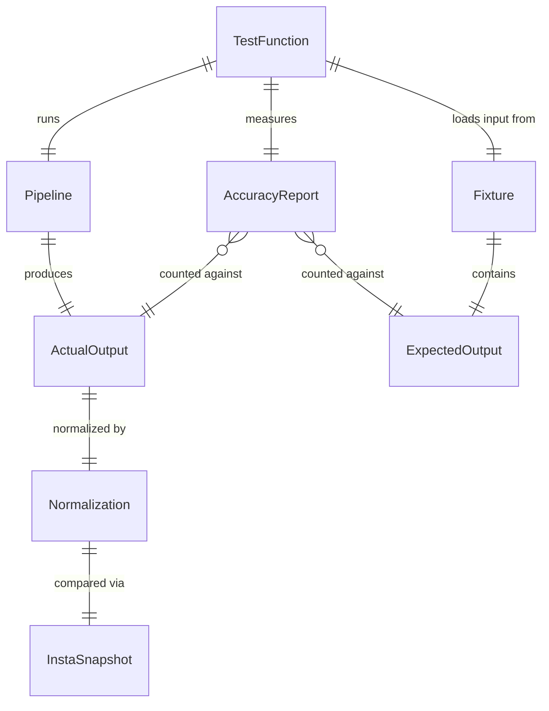

# Data Model: Golden-File Test Suite — Core

**Branch**: `021-prd-golden-file-tests` | **Date**: 2026-02-14

---

## Entities

### 1. Normalization (test utility)

The normalization function transforms OSCAL JSON output into a comparable form by replacing non-deterministic fields.

```rust
/// Normalize non-deterministic fields for stable golden-file comparison.
///
/// Walks the JSON tree recursively and:
/// 1. Replaces all UUID-format string values with a fixed placeholder
/// 2. Replaces all `last-modified` field values with a fixed timestamp
/// 3. Object keys are sorted alphabetically for deterministic comparison
///
/// # Idempotency
/// `normalize(normalize(v)) == normalize(v)` — calling twice produces the same result.
pub fn normalize_for_comparison(json: &serde_json::Value) -> serde_json::Value
```

**Fields normalized**:

| Field Pattern | Replacement | Detection |
|--------------|-------------|-----------|
| Any string matching UUID regex `^[0-9a-fA-F]{8}-[0-9a-fA-F]{4}-[0-9a-fA-F]{4}-[0-9a-fA-F]{4}-[0-9a-fA-F]{12}$` | `"00000000-0000-0000-0000-000000000000"` | Case-insensitive regex match on string values |
| `last-modified` key values | `"2026-01-01T00:00:00Z"` | Key name match |

**Validation rules**:
- Must be idempotent
- Must not modify non-UUID string values (e.g., prose text, titles)
- Must not modify numeric or boolean values
- Must handle nested objects and arrays recursively

---

### 2. AccuracyReport (test output)

Captures the result of extraction accuracy measurement for a single fixture.

```rust
/// Extraction accuracy measurement result for a single fixture.
pub struct AccuracyReport {
    /// Name of the fixture (e.g., "small", "medium", "complex")
    pub fixture_name: String,

    /// Number of requirements expected (from golden file)
    pub expected_count: usize,

    /// Number of requirements correctly extracted in actual output
    pub correct_count: usize,

    /// Accuracy percentage: (correct_count / expected_count) * 100.0
    pub accuracy_pct: f64,

    /// Stable IDs of requirements present in expected but missing from actual
    pub missed_requirements: Vec<String>,
}
```

**Validation rules**:
- If `expected_count` is 0, `accuracy_pct` = 100.0 (no requirements to miss)
- Otherwise, `accuracy_pct` = `correct_count` / `expected_count` × 100.0
- `accuracy_pct` must be >= 95.0 to pass (PRD M-8)
- `missed_requirements` contains control IDs from expected output not found in actual

---

### 3. Fixture Directory Layout

Each fixture tier contains an input and two expected outputs:

```text
tests/fixtures/golden/
├── small/
│   ├── input.md                            # 1 section, 3-5 requirements
│   ├── expected-catalog.json               # Hand-verified, schema-valid
│   └── expected-component-definition.json  # Hand-verified, schema-valid
├── medium/
│   ├── input.md                            # 3-5 sections, 10-15 requirements, 1-2 citations
│   ├── expected-catalog.json
│   └── expected-component-definition.json
└── complex/
    ├── input.md                            # 5+ sections, 20+ requirements, citations, cross-refs
    ├── expected-catalog.json
    └── expected-component-definition.json
```

**Validation rules per fixture**:
- `input.md` must have YAML frontmatter (title, version, author, date)
- `expected-catalog.json` must pass `forge::validate::validate_artifact(..., OscalModelType::Catalog)`
- `expected-component-definition.json` must pass `forge::validate::validate_artifact(..., OscalModelType::ComponentDefinition)`
- Expected outputs must be hand-verified against the input before committing

---

### 4. Accuracy Extraction Logic

**For Catalog strategy**:
- Extract all control IDs: `$.catalog.groups[*].controls[*].id` (recursive for nested groups)
- A control is "correctly extracted" if its `id` exists in the actual output

**For Component strategy**:
- Extract all implemented-requirement descriptions: `$.component-definition.components[*].control-implementations[*].implemented-requirements[*].control-id`
- A requirement is "correctly extracted" if its `control-id` exists in the actual output

---

## Relationships


