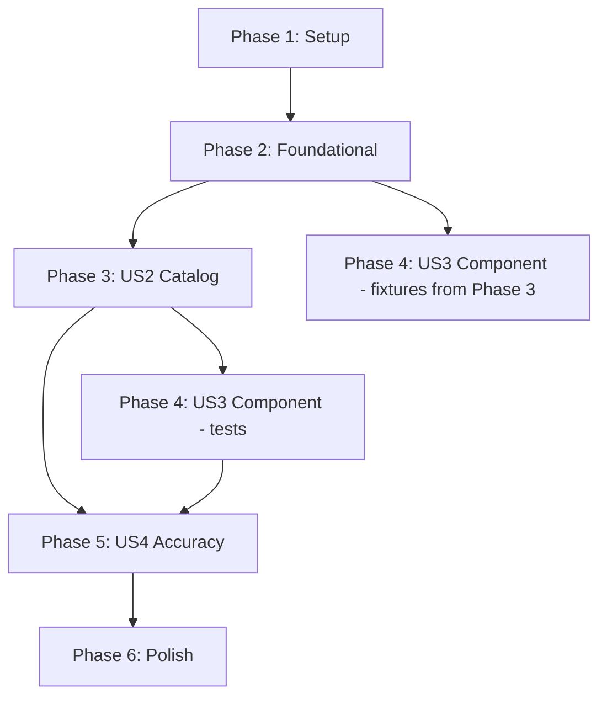

# Tasks: Golden-File Test Suite — Core

**Input**: Design documents from `/specs/021-prd-golden-file-tests/`
**Prerequisites**: plan.md, spec.md, research.md, data-model.md, contracts/golden_file_api.rs
**Source PRD**: [docs/PRD/021-prd-golden-file-tests.md](../../docs/PRD/021-prd-golden-file-tests.md)

**Tests**: Included — constitution Principle IV (TDD) is non-negotiable. Normalization and accuracy helper functions are TDD'd. Golden-file tests themselves ARE the regression tests for the pipeline.

**Organization**: Tasks grouped by PRD user story (all P1 priority). Phase 2 = shared harness infrastructure, US2 = catalog strategy, US3 = component strategy, US4 = accuracy measurement.

## Format: `[ID] [P?] [Story] Description`

- **[P]**: Can run in parallel (different files, no dependencies on incomplete tasks)
- **[Story]**: Which user story (US1, US2, US3, US4) from PRD

---

## Phase 1: Setup (Shared Infrastructure)

**Purpose**: Add dependencies and create project structure for golden-file testing.

- [x] T001 Add `insta` dev-dependency with `json` feature to Cargo.toml: run `cargo add insta@1.46.3 --dev --features json` (pin exact latest stable per constitution XI)
- [x] T002 [P] Create fixture directory structure: `tests/fixtures/golden/small/`, `tests/fixtures/golden/medium/`, `tests/fixtures/golden/complex/`
- [x] T003 [P] Create `tests/golden_file_tests.rs` skeleton with imports (`use serde_json::Value;`, `use std::path::Path;`, `use tempfile::TempDir;`) and module-level doc comment

---

## Phase 2: Foundational — Harness Infrastructure

**Purpose**: Core normalization and accuracy measurement functions that ALL golden-file tests depend on. These are shared infrastructure supporting US2, US3, and US4. Constitution Principle IV: TDD mandatory.

**⚠️ CRITICAL**: No golden-file comparison tests (Phase 3+) can begin until normalization and accuracy helpers are complete.

### TDD: Normalization Function

- [x] T004 Write unit tests for `normalize_for_comparison()` in `tests/golden_file_tests.rs`: test UUID string replacement (v4 and v5 formats), `last-modified` timestamp replacement, nested object/array traversal, non-UUID strings preserved, idempotency (`normalize(normalize(v)) == normalize(v)`), and empty/null value handling. Tests MUST FAIL (RED).
- [x] T005 Implement `normalize_for_comparison(json: &Value) -> Value` in `tests/golden_file_tests.rs`: regex-match UUID pattern `^[0-9a-f]{8}-[0-9a-f]{4}-[0-9a-f]{4}-[0-9a-f]{4}-[0-9a-f]{12}$`, replace with `"00000000-0000-0000-0000-000000000000"`; replace `last-modified` key values with `"2026-01-01T00:00:00Z"`; recurse through objects and arrays. Tests MUST PASS (GREEN).

### TDD: Accuracy Measurement

- [x] T006 Write unit tests for `measure_accuracy()` and `AccuracyReport` struct in `tests/golden_file_tests.rs`: test catalog accuracy (count controls in groups), component accuracy (count implemented-requirements), 100% accuracy case, 0% accuracy case, empty expected case, missed requirement ID reporting, and **boundary condition: exactly 95.0% accuracy (19/20) must PASS, exactly 90.0% (18/20) must FAIL** (PRD EC-4). Tests MUST FAIL (RED).
- [x] T007 Implement `AccuracyReport` struct and `measure_accuracy(fixture_name: &str, strategy: &str, expected: &Value, actual: &Value) -> AccuracyReport` in `tests/golden_file_tests.rs`: extract control IDs from `$.catalog.groups[*].controls[*].id` (catalog) or `$.component-definition.components[*].control-implementations[*].implemented-requirements[*].control-id` (component); compute intersection and difference; calculate `accuracy_pct`. Use `>= 95.0` threshold (inclusive, per research.md R-7). Tests MUST PASS (GREEN).

**Checkpoint**: Normalization and accuracy helpers tested and working. Golden-file comparison tests can now begin.

---

## Phase 3: US2 — Validate Catalog-First Strategy Output (P1) 🎯 MVP

**Goal**: Golden-file regression tests for `--strategy catalog` across all 3 fixture complexity levels.

**Independent Test**: `cargo test golden_small_catalog golden_medium_catalog golden_complex_catalog` — all pass with matching snapshots.

**Traces to**: PRD M-1 (fixtures), M-2 (catalog golden files), M-4 (normalization), M-5 (diff output), M-6 (cargo test), M-7 (catalog strategy), M-9 (parent PRD coverage)

### Small Fixture (1 section, 3-5 requirements)

- [x] T008 [US2] Create small fixture `tests/fixtures/golden/small/input.md` with YAML frontmatter (title, version, author, date) and 1 section ("Access Control") containing 4 simple atomic requirements. No citations or cross-references. Exercises M-1, M-3, M-5, M-7, M-8.
- [x] T009 [US2] Generate `tests/fixtures/golden/small/expected-catalog.json`: run `forge::pipeline::run_catalog_pipeline()` on small fixture via library API, capture output, then verify: (1) schema-validate via `forge::validate::validate_artifact(..., OscalModelType::Catalog)`, (2) confirm exactly 1 group and 4 controls, (3) confirm group title matches "Access Control", (4) spot-check first and last control prose matches source requirements, (5) confirm metadata title/version present. Save verified output as expected file.
- [x] T010 [US2] Write `golden_small_catalog` test in `tests/golden_file_tests.rs`: load `small/input.md`, run catalog pipeline to temp file, parse actual JSON, normalize with `normalize_for_comparison()`, compare with `insta::assert_json_snapshot!("small_catalog", normalized)`, accept initial snapshot.

### Medium Fixture (3-5 sections, 10-15 requirements)

- [x] T011 [US2] Create medium fixture `tests/fixtures/golden/medium/input.md` with YAML frontmatter and 3 sections ("Access Control", "Data Protection", "Incident Response") containing 12 requirements total, with 1-2 inline citations (e.g., "per NIST SP 800-53"). Exercises M-1, M-3, M-5, M-7, M-8, M-9 (back matter), M-10 (traceability).
- [x] T012 [US2] Generate `tests/fixtures/golden/medium/expected-catalog.json`: run catalog pipeline on medium fixture, then verify: (1) schema-validate via `forge::validate::validate_artifact()`, (2) confirm exactly 3 groups with titles matching section headings, (3) confirm 12 controls total distributed across groups, (4) confirm back-matter resources exist for inline citations, (5) spot-check traceability props on controls, (6) spot-check first/last control prose matches source. Save verified output.
- [x] T013 [US2] Write `golden_medium_catalog` test in `tests/golden_file_tests.rs`: same pattern as T010 but for medium fixture, use snapshot name `"medium_catalog"`.

### Complex Fixture (5+ sections, 20+ requirements)

- [x] T014 [US2] Create complex fixture `tests/fixtures/golden/complex/input.md` with YAML frontmatter and 6 sections with subsections containing 24+ requirements, including: compound statements that should be atomized (M-2), multiple citations and cross-references (M-9, M-10), parameter-like content (M-11). Must exercise ALL M-1 through M-11.
- [x] T015 [US2] Generate `tests/fixtures/golden/complex/expected-catalog.json`: run catalog pipeline on complex fixture, then verify: (1) schema-validate via `forge::validate::validate_artifact()`, (2) confirm 6 groups with correct hierarchy (nested groups for subsections), (3) confirm 24+ controls (some atomized from compound statements — M-2), (4) confirm back-matter resources for all citations, (5) confirm traceability props/links on controls (M-10, M-11), (6) spot-check control prose, (7) confirm stable UUIDs present (M-8). Save verified output.
- [x] T016 [US2] Write `golden_complex_catalog` test in `tests/golden_file_tests.rs`: same pattern as T010 but for complex fixture, use snapshot name `"complex_catalog"`.

**Checkpoint**: All 3 catalog golden-file tests pass. `cargo test golden_small_catalog golden_medium_catalog golden_complex_catalog` succeeds.

---

## Phase 4: US3 — Validate Component-First Strategy Output (P1)

**Goal**: Golden-file regression tests for `--strategy component` across all 3 fixture complexity levels.

**Independent Test**: `cargo test golden_small_component golden_medium_component golden_complex_component` — all pass with matching snapshots.

**Traces to**: PRD M-1, M-3 (component golden files), M-4, M-5, M-6, M-7 (component strategy), M-9

**Note**: Fixtures (input.md) already created in Phase 3. Only expected component outputs and tests needed.

### Small Fixture

- [x] T017 [P] [US3] Generate `tests/fixtures/golden/small/expected-component-definition.json`: run `forge::pipeline::run_component_pipeline()` on small fixture (source_profile: None), then verify: (1) schema-validate via `forge::validate::validate_artifact(..., OscalModelType::ComponentDefinition)`, (2) confirm 1 documentary component, (3) confirm 4 implemented-requirements with correct control-ids, (4) confirm metadata present. Save verified output.
- [x] T018 [US3] Write `golden_small_component` test in `tests/golden_file_tests.rs`: load `small/input.md`, run component pipeline to temp file, parse actual JSON, normalize, compare with `insta::assert_json_snapshot!("small_component", normalized)`, accept initial snapshot.

### Medium Fixture

- [x] T019 [P] [US3] Generate `tests/fixtures/golden/medium/expected-component-definition.json`: run component pipeline on medium fixture (source_profile: None), then verify: (1) schema-validate, (2) confirm 12 implemented-requirements with correct control-ids, (3) confirm traceability props on implemented-requirements, (4) spot-check narrative prose matches source. Save verified output.
- [x] T020 [US3] Write `golden_medium_component` test in `tests/golden_file_tests.rs`: same pattern for medium fixture, snapshot name `"medium_component"`.

### Complex Fixture

- [x] T021 [P] [US3] Generate `tests/fixtures/golden/complex/expected-component-definition.json`: run component pipeline on complex fixture (source_profile: None), then verify: (1) schema-validate, (2) confirm 24+ implemented-requirements (including atomized entries), (3) confirm traceability props/links (M-10, M-11), (4) spot-check narrative prose, (5) confirm stable UUIDs. Save verified output.
- [x] T022 [US3] Write `golden_complex_component` test in `tests/golden_file_tests.rs`: same pattern for complex fixture, snapshot name `"complex_component"`.

**Checkpoint**: All 6 golden-file tests pass (3 catalog + 3 component). `cargo test golden` succeeds.

---

## Phase 5: US4 — Measure Extraction Accuracy (P1)

**Goal**: Each golden-file test measures and reports extraction accuracy, enforcing the >= 95% threshold (inclusive, per research.md R-7).

**Independent Test**: `cargo test golden -- --nocapture` — accuracy reports printed showing >= 95% per fixture and overall.

**Traces to**: PRD M-8 (>= 95% accuracy, see research.md R-7), S-3 (identify missed requirements by ID)

- [x] T023 [US4] Add accuracy measurement to all 6 golden-file tests in `tests/golden_file_tests.rs`: after snapshot comparison, load the corresponding expected JSON file, call `measure_accuracy()` with the expected and actual values, assert `report.accuracy_pct >= 95.0` with descriptive failure message showing fixture name, accuracy, and missed requirements.
- [x] T024 [US4] Add accuracy summary reporting to `tests/golden_file_tests.rs`: print per-fixture accuracy (fixture name, strategy, expected count, correct count, percentage, missed IDs) via `eprintln!` so it appears with `--nocapture`. Include overall summary if feasible within test framework.
- [x] T025 [US4] Verify >= 95% extraction accuracy by running `cargo test golden -- --nocapture` and confirming all 6 tests report accuracy >= 95.0% (inclusive threshold per research.md R-7). If any fixture is below threshold, investigate and fix the fixture or pipeline as needed.

**Checkpoint**: All 6 golden-file tests pass with accuracy >= 95%. Accuracy reports visible with `--nocapture`.

---

## Phase 6: Polish & Cross-Cutting Concerns

**Purpose**: Validation, quality gates, and Should Have requirements.

### Schema Validation (M-2, M-3)

- [x] T026 [P] Schema-validate all 6 expected golden JSON files by adding a dedicated test in `tests/golden_file_tests.rs` that loads each `expected-catalog.json` and `expected-component-definition.json` and calls `forge::validate::validate_artifact()` to confirm OSCAL v1.2.0 compliance.

### Should Have Requirements

- [x] T027 Verify deterministic output (S-2): add a test in `tests/golden_file_tests.rs` that runs the catalog pipeline on the small fixture twice and asserts both runs produce identical normalized output.
- [x] T028 Verify golden file update workflow (S-1) in `tests/golden_file_tests.rs`: (1) make a trivial change to a fixture's expected output, (2) run `cargo insta test` and confirm a pending snapshot is created, (3) run `cargo insta review` and accept the change, (4) confirm the test passes after acceptance, (5) revert the change. Also implement `UPDATE_GOLDEN_FILES=1` env var support: when set, write actual (pre-normalization) pipeline output to the expected JSON file paths instead of comparing, then document this in a module-level comment.

### Edge Case Coverage (PRD EC-2, EC-3, EC-6)

- [x] T029 [P] Add edge case test for forward/backward compatibility in `tests/golden_file_tests.rs` (PRD EC-2, EC-3): construct a small expected JSON, then create an actual JSON with (a) an extra field not in expected and (b) a missing field from expected. Run through `insta` comparison and verify the diff output clearly identifies the additions and omissions.
- [x] T030 Add error handling test for missing/corrupted fixture files in `tests/golden_file_tests.rs` (PRD EC-6): implement a helper function `load_fixture(path) -> Result<String, String>` that returns a descriptive error message (not a panic) when a fixture file is missing or unreadable. Add a test that calls it with a nonexistent path and asserts the error message contains the file path. Use this helper in all golden-file test functions.

### Quality Gates

- [x] T031 [P] Run `cargo clippy --workspace --all-targets -- -D warnings` and fix any warnings in golden-file test code
- [x] T032 [P] Run `cargo fmt --check` and fix any formatting issues in golden-file test code
- [x] T033 Run `cargo test` (full suite) to confirm golden-file tests pass alongside all existing tests without conflicts or regressions

---

## Dependencies & Execution Order

### Phase Dependencies

- **Setup (Phase 1)**: No dependencies — start immediately
- **Foundational (Phase 2)**: Depends on Phase 1 (T001 for insta, T003 for test file) — BLOCKS all golden-file tests
- **US2 Catalog (Phase 3)**: Depends on Phase 2 (normalization must be complete) — MVP deliverable
- **US3 Component (Phase 4)**: Depends on Phase 2 (normalization) + Phase 3 fixture input.md files (T008, T011, T014)
- **US4 Accuracy (Phase 5)**: Depends on Phase 3 + Phase 4 (all 6 tests must exist)
- **Polish (Phase 6)**: Depends on Phase 5 (all tests passing with accuracy)

### User Story Dependencies



- **Foundational (Phase 2)**: Must complete first — provides normalization and accuracy helpers for US2/US3/US4
- **US2 (Catalog)**: After US1 — creates fixtures AND catalog tests. **MVP target.**
- **US3 (Component)**: After US1 — reuses fixtures from US2, adds component expected outputs and tests. Can overlap with US2 for fixture generation (T017/T019/T021 marked [P]).
- **US4 (Accuracy)**: After US2 + US3 — adds accuracy assertions to all 6 tests

### Within Each Phase

- Tests (T004, T006) MUST be written and FAIL before implementation (T005, T007)
- Fixture input.md MUST exist before expected output can be generated
- Expected output MUST be generated and verified before test is written
- Snapshot MUST be accepted via `cargo insta review` after first test run

### Parallel Opportunities

- **Phase 1**: T002 and T003 can run in parallel (different files)
- **Phase 3**: T011/T014 can be started while T009/T010 are in progress (different fixture directories)
- **Phase 4**: T017/T019/T021 (generate expected component outputs) can all run in parallel (different files)
- **Phase 6**: T026, T029, T031, T032 can run in parallel (independent validations)

---

## Parallel Example: Phase 3 (US2 Catalog)

```bash
# Small and medium fixture creation can overlap:
Agent A: T008 → T009 → T010 (small fixture → expected → test)
Agent B: T011 → T012 → T013 (medium fixture → expected → test)
Agent C: T014 → T015 → T016 (complex fixture → expected → test)
```

## Parallel Example: Phase 4 (US3 Component)

```bash
# All component expected outputs can generate in parallel:
Agent A: T017 → T018 (small component → test)
Agent B: T019 → T020 (medium component → test)
Agent C: T021 → T022 (complex component → test)
```

---

## Implementation Strategy

### MVP First (US1 + US2 — Phases 1-3)

1. Complete Phase 1: Setup (T001-T003)
2. Complete Phase 2: Foundational — normalization + accuracy TDD (T004-T007)
3. Complete Phase 3: US2 — all 3 catalog golden-file tests (T008-T016)
4. **STOP and VALIDATE**: `cargo test golden_small_catalog golden_medium_catalog golden_complex_catalog` — all pass
5. This alone proves the golden-file harness works end-to-end for the catalog strategy

### Incremental Delivery

1. Setup + Foundational → Harness ready
2. Add US2 (Catalog) → 3 catalog tests passing → **MVP deliverable**
3. Add US3 (Component) → 6 total tests passing → Full strategy coverage
4. Add US4 (Accuracy) → Accuracy measured and reported → MS-4 exit criterion verifiable
5. Polish → Schema validation, determinism, CI compatibility → Production-ready

### Task Count Summary

| Phase | Story | Tasks | Parallel |
|-------|-------|-------|----------|
| Phase 1: Setup | — | 3 | 2 |
| Phase 2: Foundational | — | 4 | 0 (TDD sequential) |
| Phase 3: Catalog | US2 | 9 | 3 (fixture creation) |
| Phase 4: Component | US3 | 6 | 3 (expected output generation) |
| Phase 5: Accuracy | US4 | 3 | 0 |
| Phase 6: Polish | — | 8 | 4 |
| **Total** | | **33** | **12 parallelizable** |

---

## Notes

- [P] tasks = different files, no dependencies on incomplete tasks
- [US*] label maps task to PRD user story for traceability
- All expected golden files MUST be verified (schema-validate, count controls, spot-check prose) and schema-validated before committing
- Constitution Principle IV: TDD is mandatory — unit tests for helpers written before implementation
- All fixtures are synthetic — no real organizational policy data
- Use `cargo insta review` to accept/reject snapshot changes interactively
