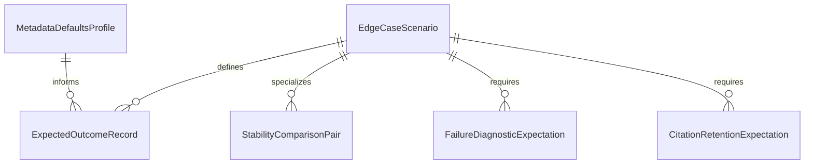

# Data Model: Golden File Edge Cases (WI-22)

**Generated by**: `/speckit.plan` | **Date**: 2026-02-21

---

## Entity Overview

WI-22 introduces no production runtime data model changes. The model below defines test-domain entities used to organize fixtures, expected outcomes, and validation assertions for edge-case golden tests.

---

## 1) EdgeCaseScenario

Represents a single parent edge case instance under test.

| Field | Type | Description |
|------|------|-------------|
| `edge_case_id` | enum (`EC-1`, `EC-2`, `EC-3`, `EC-4`, `EC-5`, `EC-6`, `EC-7`, `EC-9`, `EC-10`) | Canonical parent edge-case identifier (EC-8 excluded) |
| `slug` | string | Fixture directory slug (example: `ec04-missing-metadata`) |
| `priority` | enum (`P1`, `P2`) | Story priority inherited from spec/PRD |
| `expected_result_type` | enum (`success`, `success_with_warnings`, `failure`) | Top-level expected behavior |
| `strategy_mode` | enum (`dual_strategy`, `strategy_agnostic`) | Whether both conversion strategies are required |
| `fixture_dir` | path | Path under `tests/fixtures/edge-cases/` |

**Validation rules**:
- Exactly 9 parent scenarios exist (EC-1..EC-10 excluding EC-8).
- `strategy_mode = dual_strategy` for EC-1/2/3/4/5/6/7/10.
- `strategy_mode = strategy_agnostic` only for EC-9.

---

## 1b) SupplementalCoverageScenario

Represents non-parent edge scenarios added for Should-Have robustness coverage.

| Field | Type | Description |
|------|------|-------------|
| `supplemental_id` | enum (`S-1`, `S-2`) | PRD Should-Have scenario identifier |
| `slug` | string | Fixture directory slug (examples: `ec-citation-unusual-positions`, `ec-parameter-like-content`) |
| `strategy_mode` | enum (`dual_strategy`) | Supplemental scenarios run in both strategies for consistency checks |
| `fixture_dir` | path | Path under `tests/fixtures/edge-cases/` |

**Validation rules**:
- Supplemental scenarios do not change parent-edge-case count.
- Supplemental scenarios must not conflict with parent EC expected outcomes.

---

## 2) ExpectedOutcomeRecord

Represents expected output/error/warning artifacts for one scenario-strategy pair.

| Field | Type | Description |
|------|------|-------------|
| `scenario_id` | FK -> `EdgeCaseScenario.edge_case_id` | Owning scenario |
| `strategy` | enum (`catalog`, `component`, `agnostic`) | Test execution mode |
| `expected_output_path` | optional path | Golden output file for successful cases |
| `expected_error_substrings` | optional list<string> | Required failure substrings |
| `expected_warning_substrings` | optional list<string> | Required warning substrings |

**Validation rules**:
- Exactly one primary expectation form per record: output OR error.
- Warning list can accompany successful output records.
- Dual-strategy scenarios require both `catalog` and `component` records.
- EC-9 has one `agnostic` record only.

---

## 3) MetadataDefaultsProfile

Encodes fixed metadata fallback behavior for EC-4 and FR-006.

| Field | Type | Value |
|------|------|-------|
| `default_title` | rule | input filename stem |
| `default_version` | string | `0.0.0` |
| `default_author` | string | `Unknown` |
| `warning_policy` | rule | one warning per missing metadata field |

**Validation rules**:
- Defaults must be deterministic and reproducible in golden outputs.
- Missing `title`, `version`, and `author` each produce distinct warning assertions.

---

## 4) StabilityComparisonPair

Represents paired fixtures used to validate stable ID behavior.

| Field | Type | Description |
|------|------|-------------|
| `scenario_id` | enum (`EC-5`, `EC-6`) | Stability scenario |
| `baseline_input_path` | path | Original source variant |
| `variant_input_path` | path | Edited source variant |
| `change_kind` | enum (`whitespace_only`, `non_whitespace_text_change`) | Expected ID behavior trigger |

**Validation rules**:
- `whitespace_only` pairs (EC-5) require identical stable IDs across outputs.
- `non_whitespace_text_change` pairs (EC-6) require changed stable ID for modified requirement and warning emission.

---

## 5) FailureDiagnosticExpectation

Captures the required failure semantics for FR-003-aligned tests.

| Field | Type | Description |
|------|------|-------------|
| `cause_category_substring` | string | Classifies failure type (for example: no headings, file not found) |
| `offending_input_substring` | string | Missing path or problematic input reference |
| `remediation_hint_substring` | string | Actionable next step hint |
| `non_zero_exit_required` | bool | Always `true` for failure scenarios |

**Validation rules**:
- All three semantic substrings must be asserted in each relevant failure-path test.
- Full exact message equality is explicitly disallowed for contract stability.

---

## 6) CitationRetentionExpectation

Defines malformed citation retention behavior for FR-009.

| Field | Type | Value |
|------|------|-------|
| `resource_prop_name` | string | `url-status` |
| `resource_prop_value` | string | `unvalidated` |
| `citation_preserved` | bool | `true` |

**Validation rules**:
- Malformed citations are retained in back-matter resources.
- Back-matter resource must include `prop name="url-status" value="unvalidated"`.

---

## Relationships



---

## Scenario Lifecycle

```text
Draft Scenario
  -> Fixture Authored
  -> Expected Outcome Approved
  -> Test Implemented
  -> Test Passing in cargo test
```

---

## Coverage Invariants

1. Every applicable edge case has at least one `ExpectedOutcomeRecord`.
2. Strategy-applicable scenarios always have both strategy records.
3. EC-9 remains single-run strategy-agnostic.
4. Stability comparison pairs exist only for EC-5 and EC-6.
5. Failure scenarios always assert semantic substrings and non-zero exits.
6. Supplemental coverage scenarios (S-1/S-2) are optional extensions and do not alter parent EC completion accounting.
