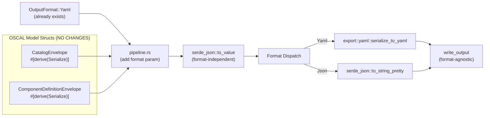

# Data Model: YAML Output (WI-27)

**Date**: 2026-02-15
**Status**: Complete

## Summary

No new data entities are introduced by WI-27. YAML serialization operates on the existing OSCAL model structs that already derive `serde::Serialize`. The only structural change is removing the non-JSON format guard to allow `OutputFormat::Yaml` to flow through the pipeline.

## Existing Entities (NO CHANGES)

### OutputFormat (already exists)

- **Location**: `src/cli/mod.rs:103-108`
- **Status**: `Yaml` variant already defined
- **Change**: None

```rust
#[derive(ValueEnum, Clone, Debug)]
pub enum OutputFormat {
    Json,
    Xml,
    Yaml,  // Already exists — just needs to be unblocked
}
```

### CatalogEnvelope

- **Location**: `src/oscal/catalog.rs:21-25`
- **Derives**: `Debug, Clone, Serialize`
- **Change**: None — `serde_yaml::to_string()` uses existing `Serialize` derive

### ComponentDefinitionEnvelope

- **Location**: `src/oscal/component_definition.rs:27-32`
- **Derives**: `Debug, Clone, Serialize`
- **Change**: None — `serde_yaml::to_string()` uses existing `Serialize` derive
- **Note**: Contains `control_implementations: Vec<serde_json::Value>` which serializes correctly to YAML

### ForgeError

- **Location**: `src/error.rs:16-96`
- **Change**: None — `ForgeError::Serialization(String)` already handles serialization failures

## New Module (NOT an entity)

### `src/export/yaml.rs`

This is a function module, not a data entity. It contains:
- `serialize_to_yaml<T: Serialize>(model: &T) -> Result<String, ForgeError>` — wraps `serde_yaml::to_string()`
- `deserialize_from_yaml<T: DeserializeOwned>(yaml: &str) -> Result<T, ForgeError>` — for equivalence testing

See [contracts/yaml_serializer.rs](contracts/yaml_serializer.rs) for the full interface contract.

## Relationships



## Validation Rules

No new validation rules. Existing rules apply:
- OSCAL JSON Schema validation runs on `serde_json::Value` regardless of output format
- Semantic + structural validation unchanged
- Output format affects only the final serialization step

## State Transitions

N/A — YAML serialization is a stateless transformation.
