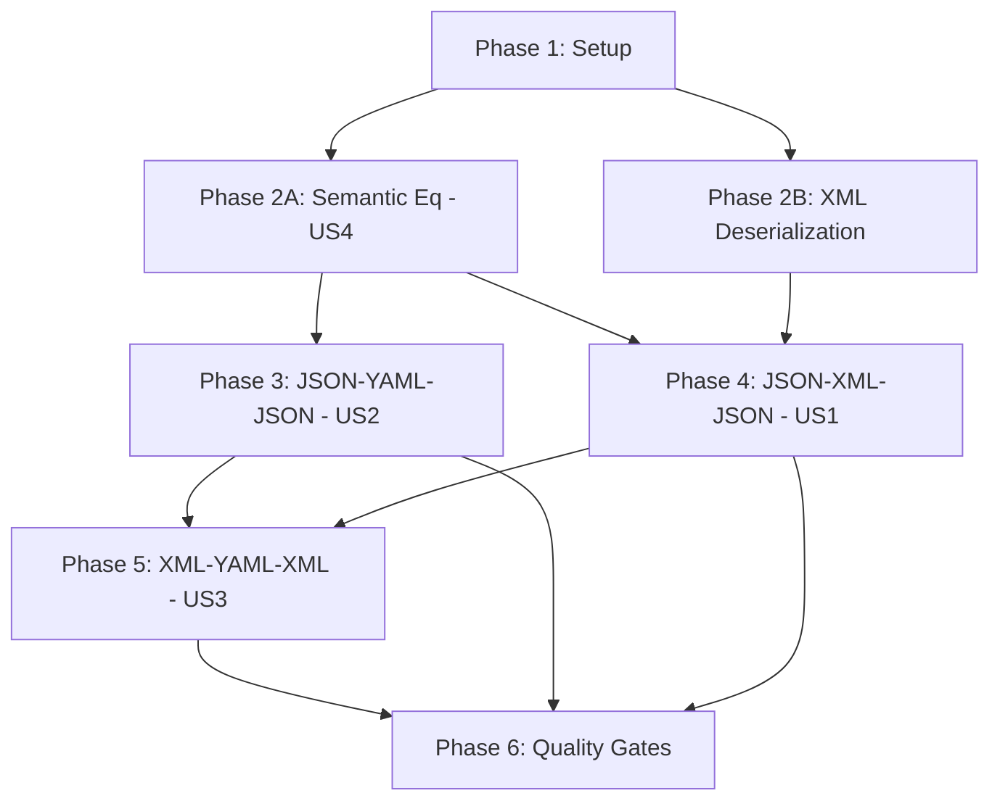

# Implementation Plan: Multi-Format Round-Trip Testing

**Branch**: `028-round-trip-testing` | **Date**: 2026-02-15 | **Spec**: [spec.md](./spec.md)
**Input**: PRD [028-prd-round-trip-testing](../../docs/PRD/028-prd-round-trip-testing.md), AR [028-ar-round-trip-testing](../../docs/AR/028-ar-round-trip-testing.md), SEC [028-sec-round-trip-testing](../../docs/SEC/028-sec-round-trip-testing.md)

## Summary

Implement automated round-trip fidelity testing verifying that OSCAL artifacts survive conversion between JSON, XML, and YAML without data loss. The approach normalizes all formats through the internal Rust model and compares `serde_json::Value` trees using a custom semantic equivalence function. A critical gap — missing XML deserialization — must be addressed first by enabling `quick-xml`'s serde feature.

## Technical Context

**Language/Version**: Rust, Edition 2024, stable 1.93.0
**Primary Dependencies**: `serde_json` 1.0.149, `quick-xml` 0.37, `serde_yaml_ng` 0.10
**Storage**: N/A — test-only code operating on in-memory models and fixture files
**Testing**: `cargo test` (integration tests in `tests/round_trip_test.rs`, unit tests in-module)
**Target Platform**: All platforms (test code, no platform-specific behavior)
**Project Type**: Single Rust crate (monorepo, existing workspace)
**Performance Goals**: N/A — correctness-focused; no performance targets for test execution
**Constraints**: 100% round-trip fidelity (zero data loss); TDD mandatory; all quality gates must pass
**Scale/Scope**: 3 round-trip paths × 2 model types × 3 fixture sizes + edge cases ≈ 25-30 test cases

## Constitution Check

*GATE: Must pass before Phase 0 research. Re-check after Phase 1 design.*

| Principle | Status | Notes |
|-----------|--------|-------|
| I. Crate-First Architecture | PASS | No new crate needed; adds modules to existing `forge` crate. Testing utilities in `src/testing/`, XML deserialization in `src/export/`. Both are cohesive with existing module boundaries. |
| II. Rust-First | PASS | All code in Rust; no FFI; no unsafe code needed. |
| III. Contract-First Development | PASS | Contracts defined in `specs/028-round-trip-testing/contracts/`: `semantic_eq.rs`, `round_trip_helpers.rs`, `xml_deserializer.rs`. Types and function signatures specified before implementation. |
| IV. Test-First Development | PASS | TDD mandatory. Tests written before implementation for semantic_eq module, XML deserialization, and round-trip helpers. |
| V. Complete Implementation | PASS | All tasks must be complete before merge. |
| VI. Performance-First Design | PASS | N/A for test code. No performance-sensitive paths. |
| VII. Security-First Design | PASS | N/A per SEC review — test-only code with no user input processing, no secrets, no attack surface. |
| VIII. Error Handling Standards | PASS | `ForgeError::Serialization` variant used for deserialization failures. `thiserror` error types. No `unwrap()` in production code (test code may use `unwrap()`). |
| IX. Observability | PASS | N/A for test code. Test output provides pass/fail per round-trip path. |
| X. Simplicity & Pragmatism | PASS | Single comparison path for all format pairs (no format-specific comparison logic). `assert_json_diff` is the only new dependency (well-maintained, MIT, minimal transitive deps). |
| XI. Current Dependency Policy | PASS | `assert_json_diff` latest stable as dev-dep. `quick-xml` feature addition (no version change). Pre-addition checks: MIT/Apache-2.0 license, actively maintained, no advisories. |

**Gate Result**: PASS — No violations. Proceed to implementation.

## Project Structure

### Documentation (this feature)

```text
specs/028-round-trip-testing/
├── plan.md              # This file
├── spec.md              # Feature specification
├── research.md          # Phase 0 research findings
├── data-model.md        # Phase 1 data model
├── quickstart.md        # Phase 1 quickstart guide
├── contracts/           # Phase 1 API contracts
│   ├── semantic_eq.rs
│   ├── round_trip_helpers.rs
│   └── xml_deserializer.rs
└── tasks.md             # Phase 2 output (generated by /speckit.tasks)
```

### Source Code (repository root)

```text
src/
├── testing/                    # NEW: Testing utilities module
│   ├── mod.rs                  # Module declaration + re-exports
│   └── semantic_eq.rs          # Semantic equivalence comparison (EquivalenceResult, EquivalenceDiff)
├── export/
│   ├── mod.rs                  # MODIFIED: Add xml_deserializer module + re-exports
│   ├── xml_serializer.rs       # EXISTING: XML serialization (WI-26)
│   ├── xml_deserializer.rs     # NEW: XML deserialization via quick-xml serde
│   └── yaml.rs                 # EXISTING: YAML serialization/deserialization (WI-27)
├── oscal/
│   ├── parts.rs                # POTENTIALLY MODIFIED: XML serde annotations on OscalProp
│   ├── back_matter.rs          # POTENTIALLY MODIFIED: XML serde annotations on OscalLink
│   └── ...                     # EXISTING: No other changes
├── lib.rs                      # MODIFIED: Add `pub mod testing;`
└── ...

tests/
├── round_trip_test.rs          # NEW: Integration tests for all round-trip paths
├── fixtures/
│   └── golden/
│       ├── small/              # EXISTING: expected-catalog.json, expected-component-definition.json
│       ├── medium/             # EXISTING: expected-catalog.json, expected-component-definition.json
│       └── complex/            # EXISTING: expected-catalog.json, expected-component-definition.json
└── ...
```

**Structure Decision**: Single project structure. New modules (`src/testing/`, `src/export/xml_deserializer.rs`) extend the existing crate layout. Integration tests live in `tests/round_trip_test.rs` alongside existing test files.

## Complexity Tracking

No constitution violations — no complexity justification needed.

## Implementation Phases

### Phase 1: Setup (Shared Infrastructure)

**Goal**: Project initialization — dependency changes and module scaffolding.

**Files**:
- `Cargo.toml` (add `assert_json_diff` dev-dep, enable `serde` feature on `quick-xml`)
- `src/testing/mod.rs` (new, scaffold)
- `src/testing/semantic_eq.rs` (new, scaffold)
- `src/export/xml_deserializer.rs` (new, scaffold)
- `src/lib.rs` (add `pub mod testing;`)
- `src/export/mod.rs` (add `pub mod xml_deserializer;` + re-exports)

**No dependencies** — can start immediately.

### Phase 2A: Semantic Equivalence Module (Foundation — US4)

**Goal**: Implement and test the reusable semantic equivalence comparison utility.

**Files**:
- `src/testing/semantic_eq.rs` (implement)

**Contract**: `contracts/semantic_eq.rs`

**TDD Cycle**:
1. Write unit tests for `assert_semantic_equivalence`:
   - Equal objects (same keys, same values) → equivalent
   - Different key ordering → equivalent
   - Missing key → not equivalent, diff shows path
   - Extra key → not equivalent, diff shows path
   - Value mismatch → not equivalent, diff shows path and values
   - Array order preserved → equivalent when same, not equivalent when different
   - Type mismatch (string vs number) → not equivalent
   - Nested objects (5+ levels) → correct path reporting
   - Empty objects/arrays → equivalent
2. Implement `assert_semantic_equivalence` to pass all tests
3. Refactor if needed

**PRD Traceability**: M-5, M-6, M-7, M-8, S-3

### Phase 2B: XML Deserialization (Prerequisite for US1, US3)

**Goal**: Enable XML deserialization for Catalog and Component Definition models.

**Files**:
- `src/export/xml_deserializer.rs` (implement)
- `src/oscal/parts.rs` (potentially: XML serde annotations on `OscalProp`)
- `src/oscal/back_matter.rs` (potentially: XML serde annotations on `OscalLink`)

**Contract**: `contracts/xml_deserializer.rs`

**TDD Cycle**:
1. Write unit tests for `deserialize_catalog_from_xml`:
   - Deserialize XML output from `serialize_catalog_to_xml` → CatalogEnvelope
   - Verify all fields populated correctly
   - Test with small golden fixture (serialize to XML, deserialize back)
2. Implement `deserialize_catalog_from_xml` to pass tests
3. Write unit tests for `deserialize_component_from_xml`:
   - Same pattern as catalog
4. Implement `deserialize_component_from_xml` to pass tests
5. If quick-xml serde annotations are needed on model structs, add them ensuring JSON serialization is not affected

**Risk**: quick-xml serde may not be compatible with the custom XML output. Fallback: implement manual XML deserialization using `quick_xml::Reader` for the specific model types.

**PRD Traceability**: Prerequisite for M-1, M-3

### Phase 3: JSON → YAML → JSON Round-Trip Tests (US2 — P1, MVP)

**Goal**: Verify YAML round-trip fidelity (fully supported path, no new dependencies).

**Depends on**: Phase 2A (semantic equivalence)

**Files**:
- `tests/round_trip_test.rs` (new, or extend)

**TDD Cycle**:
1. Write round-trip tests for Catalog:
   - Load `tests/fixtures/golden/small/expected-catalog.json`
   - Deserialize to `CatalogEnvelope`
   - Serialize to YAML via `serialize_to_yaml`
   - Deserialize YAML back to `CatalogEnvelope` via `deserialize_from_yaml`
   - Serialize back to `serde_json::Value`
   - Assert semantic equivalence with original
   - Repeat for medium and complex fixtures
2. Write round-trip tests for Component Definition:
   - Same pattern with `ComponentDefinitionEnvelope`
   - All three fixture sizes
3. Write YAML type coercion edge-case tests:
   - Construct models with string values: "true", "false", "1.0", "null", "yes", "no", "on", "off"
   - Round-trip through YAML
   - Verify all remain `Value::String` (not coerced)
4. Write edge-case tests:
   - Empty arrays preserved
   - ISO 8601 timestamps remain strings
   - UUID strings remain strings
   - Numeric strings ("10", "3.14") remain strings
   - Deeply nested structures (5+ levels) preserved

**PRD Traceability**: M-2, M-4, M-8, S-2

### Phase 4: JSON → XML → JSON Round-Trip Tests (US1 — P1)

**Goal**: Verify XML round-trip fidelity.

**Depends on**: Phase 2A (semantic equivalence) AND Phase 2B (XML deserialization)

**Files**:
- `tests/round_trip_test.rs` (extend)

**TDD Cycle**:
1. Write round-trip tests for Catalog:
   - Load golden JSON fixture → deserialize to `CatalogEnvelope`
   - Serialize to XML via `serialize_catalog_to_xml`
   - Deserialize XML back to `CatalogEnvelope` via `deserialize_catalog_from_xml`
   - Serialize back to `serde_json::Value`
   - Assert semantic equivalence
   - All three fixture sizes
2. Write round-trip tests for Component Definition:
   - Same pattern with component types
   - All three fixture sizes
3. Write edge-case tests:
   - Array ordering preserved through XML
   - Deeply nested structures preserved through XML

**PRD Traceability**: M-1, M-3, M-5, M-6

### Phase 5: XML → YAML → XML Round-Trip Tests (US3 — P2)

**Goal**: Verify cross-format round-trip fidelity between non-JSON formats.

**Depends on**: Phase 3 (YAML path) AND Phase 4 (XML path)

**Files**:
- `tests/round_trip_test.rs` (extend)

**TDD Cycle**:
1. Write round-trip tests for Catalog:
   - Load golden JSON fixture → deserialize to `CatalogEnvelope`
   - Serialize to XML (starting XML)
   - Deserialize XML to model
   - Serialize to YAML
   - Deserialize YAML to model
   - Serialize back to XML
   - Compare XML output through model normalization (serialize both to JSON Value, compare)
2. Repeat for Component Definition

**PRD Traceability**: S-1

### Phase 6: Quality Gates & Cleanup

**Goal**: Ensure all quality gates pass.

1. Run `cargo test --workspace` — all tests pass
2. Run `cargo clippy --workspace --all-targets -- -D warnings` — zero warnings
3. Run `cargo fmt --check` — no formatting violations
4. Review test coverage — all PRD M-requirements have corresponding tests
5. Verify test naming convention is clear (e.g., `test_catalog_json_xml_json_small`)

**PRD Traceability**: All success criteria (SC-001 through SC-005)

## Implementation Guardrails (from AR)

- **DO NOT** compare serialized output as raw strings (fails on key ordering)
- **DO NOT** skip YAML type coercion edge cases ("true", "1.0", "null" must remain strings)
- **DO NOT** write format-specific comparison logic for each pair (normalize through model)
- **DO NOT** modify serialization code in this WI (round-trip testing is read-only, except XML deserialization which is a new capability)
- **MUST** verify array element ordering is preserved
- **MUST** produce structured diffs on failure with JSON Pointer paths
- **MUST** test both Catalog and Component Definition model types

## Dependencies



Phase 1 (Setup) has no dependencies — can start immediately.
Phase 2A and Phase 2B can proceed in parallel after Phase 1.
Phase 3 depends on Phase 2A only — can start before Phase 2B completes.
Phase 4 depends on Phase 2A and Phase 2B.
Phase 5 depends on Phase 3 and Phase 4.
Phase 6 is the final gate.
