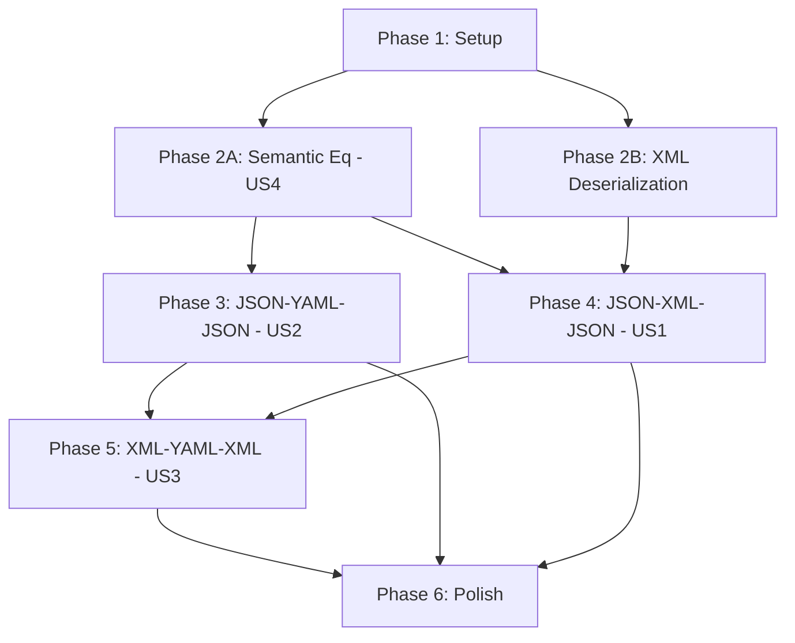

# Tasks: Multi-Format Round-Trip Testing (WI-28)

**Input**: Design documents from `/specs/028-round-trip-testing/`
**Prerequisites**: plan.md, spec.md, research.md, data-model.md, contracts/
**Branch**: `028-round-trip-testing`

**Tests**: Included — constitution principle IV (TDD) is NON-NEGOTIABLE. Tests written before implementation.

**Organization**: Tasks grouped by user story to enable independent implementation and testing.

## Format: `[ID] [P?] [Story] Description`

- **[P]**: Can run in parallel (different files, no dependencies)
- **[Story]**: Which user story (US1, US2, US3, US4)
- Exact file paths included in descriptions

## User Story Mapping

| Story | PRD Priority | Title | PRD Requirements |
|-------|-------------|-------|-----------------|
| US4 | P1 | Semantic Equivalence Utility | M-5, M-6, M-7, M-8, S-3 |
| US2 | P1 | JSON → YAML → JSON Round-Trip | M-2, M-4, M-8, S-2 |
| US1 | P1 | JSON → XML → JSON Round-Trip | M-1, M-3, M-5, M-6 |
| US3 | P2 | XML → YAML → XML Round-Trip | S-1 |

---

## Phase 1: Setup (Shared Infrastructure)

**Purpose**: Project initialization — dependency changes and module scaffolding

- [X] T001 Configure Cargo.toml dependencies for round-trip testing (`quick-xml` for XML deserialization, existing `serde_yaml_ng` for YAML)
- [X] T002 [P] Create testing module scaffold: `src/testing/mod.rs` with `pub mod semantic_eq;` declaration
- [X] T003 [P] Create empty `src/testing/semantic_eq.rs` with module doc comment
- [X] T004 [P] Create empty `src/export/xml_deserializer.rs` with module doc comment
- [X] T005 Add `pub mod testing;` to `src/lib.rs`
- [X] T006 Add `pub mod xml_deserializer;` and re-exports for `deserialize_catalog_from_xml`, `deserialize_component_from_xml` to `src/export/mod.rs`
- [X] T007 Verify `cargo build` succeeds with new module structure and dependencies

---

## Phase 2: Foundational (Blocking Prerequisites)

**Purpose**: Semantic equivalence utility (US4) and XML deserialization — MUST complete before round-trip story work

**CRITICAL**: No round-trip test work (US1, US2, US3) can begin until this phase is complete

### 2A: Semantic Equivalence Utility (US4)

**Goal**: Reusable semantic equivalence comparison utility for all round-trip assertions

**Independent Test**: Compare two JSON documents with identical content but different key ordering → "equivalent"

**Contract**: `specs/028-round-trip-testing/contracts/semantic_eq.rs`

#### Tests for US4

> **Write these tests FIRST, ensure they FAIL before implementation**

- [X] T008 [P] [US4] Write unit test: equal objects with same keys/values report equivalent, in `src/testing/semantic_eq.rs` `#[cfg(test)]` module
- [X] T009 [P] [US4] Write unit test: objects with different key ordering report equivalent, in `src/testing/semantic_eq.rs`
- [X] T010 [P] [US4] Write unit test: missing key reports not-equivalent with path to missing key, in `src/testing/semantic_eq.rs`
- [X] T011 [P] [US4] Write unit test: extra key reports not-equivalent with path to extra key, in `src/testing/semantic_eq.rs`
- [X] T012 [P] [US4] Write unit test: value mismatch reports not-equivalent with path, expected, and actual values, in `src/testing/semantic_eq.rs`
- [X] T013 [P] [US4] Write unit test: arrays with same elements in same order report equivalent, in `src/testing/semantic_eq.rs`
- [X] T014 [P] [US4] Write unit test: arrays with same elements in different order report not-equivalent (PRD M-6), in `src/testing/semantic_eq.rs`
- [X] T015 [P] [US4] Write unit test: type mismatch (string "1" vs number 1) reports not-equivalent (PRD M-8), in `src/testing/semantic_eq.rs`
- [X] T016 [P] [US4] Write unit test: deeply nested objects (5+ levels) report correct JSON Pointer path on mismatch, in `src/testing/semantic_eq.rs`
- [X] T017 [P] [US4] Write unit test: empty objects `{}` and empty arrays `[]` report equivalent, in `src/testing/semantic_eq.rs`
- [X] T018 [P] [US4] Write unit test: array length mismatch reports not-equivalent with length difference, in `src/testing/semantic_eq.rs`

#### Implementation for US4

- [X] T019 [US4] Implement `EquivalenceResult` and `EquivalenceDiff` structs in `src/testing/semantic_eq.rs` per contract
- [X] T020 [US4] Implement `assert_semantic_equivalence` function with recursive `compare_values` helper in `src/testing/semantic_eq.rs`
- [X] T021 [US4] Verify all T008–T018 unit tests pass — run `cargo test --lib testing::semantic_eq`
- [X] T022 [US4] Add re-exports of `EquivalenceResult`, `EquivalenceDiff`, `assert_semantic_equivalence` from `src/testing/mod.rs`

**Checkpoint**: `assert_semantic_equivalence` is functional, all unit tests pass, module is importable from integration tests

### 2B: XML Deserialization (Prerequisite for US1, US3)

**Goal**: Enable deserialization of OSCAL XML back to typed model structs

**Contract**: `specs/028-round-trip-testing/contracts/xml_deserializer.rs`

**Risk**: quick-xml serde may need annotation tuning on model structs. If incompatible, fall back to manual `quick_xml::Reader`-based parsing.

#### Tests for XML Deserialization

> **Write these tests FIRST, ensure they FAIL before implementation**

- [X] T023 [P] Write unit test: `deserialize_catalog_from_xml` round-trips a small catalog (serialize with `serialize_catalog_to_xml`, deserialize back, verify fields match), in `src/export/xml_deserializer.rs` `#[cfg(test)]` module
- [X] T024 [P] Write unit test: `deserialize_catalog_from_xml` preserves all metadata fields (uuid, title, last-modified, version, oscal-version), in `src/export/xml_deserializer.rs`
- [X] T025 [P] Write unit test: `deserialize_catalog_from_xml` preserves group and control structure (ids, titles, props, parts), in `src/export/xml_deserializer.rs`
- [X] T026 [P] Write unit test: `deserialize_component_from_xml` round-trips a small component definition, in `src/export/xml_deserializer.rs`
- [X] T027 [P] Write unit test: `deserialize_component_from_xml` preserves component fields (uuid, type, title, description), in `src/export/xml_deserializer.rs`
- [X] T028 [P] Write unit test: `deserialize_catalog_from_xml` returns `ForgeError::Serialization` on invalid XML input, in `src/export/xml_deserializer.rs`

#### Implementation for XML Deserialization

- [X] T029 Implement `deserialize_catalog_from_xml` in `src/export/xml_deserializer.rs` using manual `quick_xml::Reader`-based parsing (fallback from R-6; serde approach was incompatible with custom Writer-based serializer)
- [X] T030 If needed: add XML serde annotations (`#[serde(rename = "@attr")]`) to `OscalProp` in `src/oscal/parts.rs` for XML attribute deserialization — verify JSON serialization is NOT affected
- [X] T031 If needed: add XML serde annotations to `OscalLink` in `src/oscal/back_matter.rs` for XML attribute deserialization — verify JSON serialization is NOT affected
- [X] T032 Implement `deserialize_component_from_xml` in `src/export/xml_deserializer.rs` using manual `quick_xml::Reader`-based parsing
- [X] T033 Verify all T023–T028 unit tests pass — run `cargo test --lib export::xml_deserializer`
- [X] T034 Verify existing XML serialization tests still pass — run `cargo test --test xml_catalog_test --test xml_component_test --test xml_validation_test`

**Checkpoint**: XML deserialization works for both Catalog and Component Definition. All existing tests still pass. Foundation ready — user story round-trip work can begin.

---

## Phase 3: User Story 2 — JSON → YAML → JSON Round-Trip (Priority: P1) 🎯 MVP

**Goal**: Verify JSON → YAML → JSON round-trip fidelity for Catalog and Component Definition

**Independent Test**: Load a golden JSON fixture, round-trip through YAML, compare with `assert_semantic_equivalence` → all pass

**Why MVP**: YAML path is fully functional (no new deserialization needed). Delivers immediate validation of WI-27 fidelity. Catches YAML type coercion issues.

**PRD Requirements**: M-2, M-4, M-8, S-2

### Tests for US2

> **Write these tests FIRST in `tests/round_trip_test.rs`, ensure they FAIL before implementation**

- [X] T035 [P] [US2] Write integration test: `test_catalog_json_yaml_json_small` — load `tests/fixtures/golden/small/expected-catalog.json`, deserialize to `CatalogEnvelope`, serialize to YAML, deserialize YAML back to `CatalogEnvelope`, serialize to `serde_json::Value`, assert semantic equivalence with original, in `tests/round_trip_test.rs`
- [X] T036 [P] [US2] Write integration test: `test_catalog_json_yaml_json_medium` — same pattern with `tests/fixtures/golden/medium/expected-catalog.json`, in `tests/round_trip_test.rs`
- [X] T037 [P] [US2] Write integration test: `test_catalog_json_yaml_json_complex` — same pattern with `tests/fixtures/golden/complex/expected-catalog.json` (PRD S-4: 50+ controls), in `tests/round_trip_test.rs`
- [X] T038 [P] [US2] Write integration test: `test_component_json_yaml_json_small` — same pattern with `tests/fixtures/golden/small/expected-component-definition.json` and `ComponentDefinitionEnvelope`, in `tests/round_trip_test.rs`
- [X] T039 [P] [US2] Write integration test: `test_component_json_yaml_json_medium` — same pattern with `tests/fixtures/golden/medium/expected-component-definition.json`, in `tests/round_trip_test.rs`
- [X] T040 [P] [US2] Write integration test: `test_component_json_yaml_json_complex` — same pattern with `tests/fixtures/golden/complex/expected-component-definition.json`, in `tests/round_trip_test.rs`

### YAML Type Coercion Edge Cases (PRD M-8, S-2, EC-3 through EC-7)

- [X] T041 [P] [US2] Write edge-case test: `test_yaml_preserves_boolean_like_strings` — OSCAL model with string values "true", "false", "yes", "no", "on", "off" round-tripped through YAML remain `Value::String`, in `tests/round_trip_test.rs`
- [X] T042 [P] [US2] Write edge-case test: `test_yaml_preserves_numeric_strings` — string values "10", "3.14", "1.0" remain strings after YAML round-trip (not coerced to numbers), in `tests/round_trip_test.rs`
- [X] T043 [P] [US2] Write edge-case test: `test_yaml_preserves_null_like_strings` — string value "null" remains a string after YAML round-trip (not coerced to null), in `tests/round_trip_test.rs`
- [X] T044 [P] [US2] Write edge-case test: `test_yaml_preserves_timestamp_strings` — ISO 8601 timestamp string "2026-09-08T10:00:00Z" remains a string after YAML round-trip (EC-3), in `tests/round_trip_test.rs`
- [X] T045 [P] [US2] Write edge-case test: `test_yaml_preserves_uuid_strings` — UUID string "550e8400-e29b-41d4-a716-446655440000" remains a string after YAML round-trip (EC-4), in `tests/round_trip_test.rs`
- [X] T046 [P] [US2] Write edge-case test: `test_yaml_preserves_empty_arrays` — empty `[]` arrays survive YAML round-trip (EC-2), in `tests/round_trip_test.rs`
- [X] T047 [P] [US2] Write edge-case test: `test_yaml_preserves_deeply_nested` — objects 5+ levels deep survive YAML round-trip (EC-5), in `tests/round_trip_test.rs`
- [X] T075 [P] [US2] Write edge-case test: `test_yaml_preserves_array_ordering` — OSCAL catalog with multiple controls in a group, verify control order preserved through YAML round-trip (PRD M-6), in `tests/round_trip_test.rs`

### Implementation for US2

- [X] T048 [US2] Implement round-trip helper function `round_trip_catalog_json_yaml_json` in `tests/round_trip_test.rs` (or shared helper module): deserialize JSON → `CatalogEnvelope` → `serialize_to_yaml` → `deserialize_from_yaml::<CatalogEnvelope>` → `serde_json::to_value`
- [X] T049 [US2] Implement round-trip helper function `round_trip_component_json_yaml_json` in `tests/round_trip_test.rs`: same pattern with `ComponentDefinitionEnvelope`
- [X] T050 [US2] Implement YAML edge-case test fixtures: construct `serde_json::Value` objects with YAML-ambiguous string values for T041–T047
- [X] T051 [US2] Verify all T035–T047, T075 tests pass — run `cargo test --test round_trip_test`

**Checkpoint**: JSON → YAML → JSON round-trip verified for both model types at all fixture sizes. YAML type coercion edge cases verified. MVP deliverable.

---

## Phase 4: User Story 1 — JSON → XML → JSON Round-Trip (Priority: P1)

**Goal**: Verify JSON → XML → JSON round-trip fidelity for Catalog and Component Definition

**Independent Test**: Load a golden JSON fixture, round-trip through XML, compare with `assert_semantic_equivalence` → all pass

**Depends on**: Phase 2B (XML deserialization)

**PRD Requirements**: M-1, M-3, M-5, M-6

### Tests for US1

> **Write these tests FIRST in `tests/round_trip_test.rs`, ensure they FAIL before implementation**

- [X] T052 [P] [US1] Write integration test: `test_catalog_json_xml_json_small` — load `tests/fixtures/golden/small/expected-catalog.json`, deserialize to `CatalogEnvelope`, serialize to XML via `serialize_catalog_to_xml`, deserialize XML back via `deserialize_catalog_from_xml`, serialize to `serde_json::Value`, assert semantic equivalence, in `tests/round_trip_test.rs`
- [X] T053 [P] [US1] Write integration test: `test_catalog_json_xml_json_medium` — same pattern with medium fixture, in `tests/round_trip_test.rs`
- [X] T054 [P] [US1] Write integration test: `test_catalog_json_xml_json_complex` — same pattern with complex fixture, in `tests/round_trip_test.rs`
- [X] T055 [P] [US1] Write integration test: `test_component_json_xml_json_small` — same pattern with `expected-component-definition.json` and component types, in `tests/round_trip_test.rs`
- [X] T056 [P] [US1] Write integration test: `test_component_json_xml_json_medium` — same pattern with medium component fixture, in `tests/round_trip_test.rs`
- [X] T057 [P] [US1] Write integration test: `test_component_json_xml_json_complex` — same pattern with complex component fixture, in `tests/round_trip_test.rs`

### XML-Specific Edge Cases (PRD M-5, M-6, EC-5)

- [X] T058 [P] [US1] Write edge-case test: `test_xml_preserves_array_ordering` — OSCAL catalog with multiple controls in a group, verify control order preserved through XML round-trip (PRD M-6), in `tests/round_trip_test.rs`
- [X] T059 [P] [US1] Write edge-case test: `test_xml_preserves_deeply_nested` — objects 5+ levels deep survive XML round-trip (EC-5), in `tests/round_trip_test.rs`

### Implementation for US1

- [X] T060 [US1] Implement round-trip helper function `round_trip_catalog_json_xml_json` in `tests/round_trip_test.rs`: deserialize JSON → `CatalogEnvelope` → `serialize_catalog_to_xml` → `deserialize_catalog_from_xml` → `serde_json::to_value`
- [X] T061 [US1] Implement round-trip helper function `round_trip_component_json_xml_json` in `tests/round_trip_test.rs`: same pattern with component types
- [X] T062 [US1] Verify all T052–T059 tests pass — run `cargo test --test round_trip_test`

**Checkpoint**: JSON → XML → JSON round-trip verified for both model types at all fixture sizes. Array ordering preserved. Core P1 requirements (M-1, M-3) satisfied.

---

## Phase 5: User Story 3 — XML → YAML → XML Round-Trip (Priority: P2)

**Goal**: Verify cross-format round-trip fidelity between non-JSON formats

**Independent Test**: Load golden JSON fixture, serialize to XML (starting point), round-trip through YAML and back to XML, normalize both XMLs to JSON Value, compare → pass

**Depends on**: Phase 3 (YAML path) and Phase 4 (XML path)

**PRD Requirements**: S-1

### Tests for US3

> **Write these tests FIRST in `tests/round_trip_test.rs`, ensure they FAIL before implementation**

- [X] T063 [P] [US3] Write integration test: `test_catalog_xml_yaml_xml_small` — load small catalog fixture, serialize to XML, deserialize XML → model → YAML → model → XML, normalize both XMLs to JSON Value via model, assert semantic equivalence, in `tests/round_trip_test.rs`
- [X] T064 [P] [US3] Write integration test: `test_catalog_xml_yaml_xml_medium` — same pattern with medium fixture, in `tests/round_trip_test.rs`
- [X] T065 [P] [US3] Write integration test: `test_component_xml_yaml_xml_small` — same pattern with component definition, in `tests/round_trip_test.rs`
- [X] T076 [P] [US3] Write integration test: `test_catalog_xml_yaml_xml_complex` — same pattern with complex fixture for large-scale XML-YAML-XML fidelity (PRD S-4), in `tests/round_trip_test.rs`
- [X] T077 [P] [US3] Write edge-case test: `test_xml_yaml_xml_preserves_namespace` — verify OSCAL namespace declaration (`xmlns="http://csrc.nist.gov/ns/oscal/1.0"`) is preserved through XML → YAML → XML round-trip (PRD US3-AC2), in `tests/round_trip_test.rs`

### Implementation for US3

- [X] T066 [US3] Implement round-trip helper function `round_trip_catalog_xml_yaml_xml` in `tests/round_trip_test.rs`: XML string → `deserialize_catalog_from_xml` → `serialize_to_yaml` → `deserialize_from_yaml::<CatalogEnvelope>` → `serialize_catalog_to_xml` → normalize both via `serde_json::to_value` → compare
- [X] T067 [US3] Implement round-trip helper function `round_trip_component_xml_yaml_xml` if needed, in `tests/round_trip_test.rs`
- [X] T068 [US3] Verify all T063–T065, T076–T077 tests pass — run `cargo test --test round_trip_test`

**Checkpoint**: All three round-trip paths verified. All user stories independently functional.

---

## Phase 6: Polish & Cross-Cutting Concerns

**Purpose**: Quality gates, cleanup, and final validation

- [X] T069 Run full test suite: `cargo test --workspace` — all tests pass (including pre-existing tests)
- [X] T070 [P] Run clippy: `cargo clippy --workspace --all-targets -- -D warnings` — zero warnings
- [X] T071 [P] Run formatter: `cargo fmt --check` — no violations
- [X] T072 Audit test naming convention: verify all round-trip tests follow pattern `test_{model}_{format1}_{format2}_{format3}_{size}`
- [X] T073 Verify PRD requirement coverage: each M-requirement (M-1 through M-8) has at least one passing test
- [X] T074 Verify all existing tests still pass (no regression): `cargo test --test xml_catalog_test --test xml_component_test --test yaml_equivalence_test --test yaml_serializer_test --test yaml_security_test`

---

## Dependencies & Execution Order

### Phase Dependencies

- **Setup (Phase 1)**: No dependencies — can start immediately
- **Foundational (Phase 2)**: Depends on Phase 1 — BLOCKS all user story phases
  - Phase 2A (US4: Semantic Eq) and Phase 2B (XML Deser) can run in parallel
- **US2 (Phase 3)**: Depends on Phase 2A (semantic eq) only — can start before Phase 2B completes
- **US1 (Phase 4)**: Depends on Phase 2A AND Phase 2B — requires XML deserialization
- **US3 (Phase 5)**: Depends on Phase 3 AND Phase 4 (both format paths must work)
- **Polish (Phase 6)**: Depends on all desired user story phases being complete

### User Story Dependencies



### Within Each User Story

- Tests MUST be written and FAIL before implementation (constitution principle IV)
- Helper functions before test implementations
- Edge cases after core round-trip tests
- Story complete checkpoint before moving to next

### Parallel Opportunities

- **Phase 1**: T002, T003, T004 can run in parallel (different files)
- **Phase 2A**: All T008–T018 tests can be written in parallel (same file but independent tests)
- **Phase 2B**: T023–T028 tests can be written in parallel
- **Phase 2A and 2B**: Can proceed in parallel (different modules)
- **Phase 3**: T035–T047, T075 tests can be written in parallel
- **Phase 4**: T052–T059 tests can be written in parallel
- **Phase 5**: T063–T065, T076–T077 tests can be written in parallel
- **Phase 6**: T070, T071 can run in parallel

---

## Parallel Example: Phase 2 (Foundational)

```text
# Launch Phase 2A and 2B in parallel:

# Agent A: Semantic Equivalence (US4)
Task: "Write unit tests T008-T018 in src/testing/semantic_eq.rs"
Task: "Implement EquivalenceResult, EquivalenceDiff, assert_semantic_equivalence (T019-T022)"

# Agent B: XML Deserialization
Task: "Write unit tests T023-T028 in src/export/xml_deserializer.rs"
Task: "Implement deserialize_catalog_from_xml, deserialize_component_from_xml (T029-T034)"
```

## Parallel Example: Phase 3 (US2 — YAML Round-Trip)

```text
# Launch all YAML round-trip tests in parallel:
Task: "T035 test_catalog_json_yaml_json_small"
Task: "T036 test_catalog_json_yaml_json_medium"
Task: "T037 test_catalog_json_yaml_json_complex"
Task: "T038 test_component_json_yaml_json_small"
Task: "T039 test_component_json_yaml_json_medium"
Task: "T040 test_component_json_yaml_json_complex"

# Then launch edge-case tests in parallel:
Task: "T041-T047 YAML type coercion edge cases"
```

---

## Implementation Strategy

### MVP First (US4 + US2 Only)

1. Complete Phase 1: Setup
2. Complete Phase 2A: Semantic Equivalence utility (US4)
3. Complete Phase 3: JSON → YAML → JSON round-trip (US2)
4. **STOP and VALIDATE**: All YAML round-trip tests pass, YAML type coercion verified
5. This delivers: PRD M-2, M-4, M-5, M-6, M-7, M-8, S-2, S-3

### Full Delivery

1. Complete Setup + Foundational (Phase 1 + 2) → Foundation ready
2. Add US2 (Phase 3) → YAML round-trip verified → **MVP!**
3. Add US1 (Phase 4) → XML round-trip verified → **Core P1 complete**
4. Add US3 (Phase 5) → Cross-format round-trip verified → **All S-1 complete**
5. Polish (Phase 6) → Quality gates pass → **Ship-ready**

### PRD Traceability Summary

| PRD Req | Task(s) | Phase |
|---------|---------|-------|
| M-1 (JSON-XML-JSON Catalog) | T052–T054, T060 | Phase 4 |
| M-2 (JSON-YAML-JSON Catalog) | T035–T037, T048 | Phase 3 |
| M-3 (JSON-XML-JSON Component) | T055–T057, T061 | Phase 4 |
| M-4 (JSON-YAML-JSON Component) | T038–T040, T049 | Phase 3 |
| M-5 (Ignore key ordering) | T009, T019–T020 | Phase 2A |
| M-6 (Preserve array ordering) | T013–T014, T058, T075 | Phase 2A, Phase 3, Phase 4 |
| M-7 (Structural diff on failure) | T010–T012, T016, T019–T020 | Phase 2A |
| M-8 (Preserve data types) | T015, T041–T045 | Phase 2A, Phase 3 |
| S-1 (XML-YAML-XML) | T063–T068, T076–T077 | Phase 5 |
| S-2 (YAML-ambiguous values) | T041–T043 | Phase 3 |
| S-3 (Reusable module) | T019–T022 | Phase 2A |
| S-4 (Large fixture 50+ controls) | T037, T040, T054, T057, T076 | Phase 3, Phase 4, Phase 5 |

---

## Notes

- [P] tasks = different files, no dependencies
- [Story] label maps task to specific user story for PRD traceability
- Each user story is independently completable and testable
- TDD: verify tests fail before implementing (constitution principle IV)
- Commit after each phase or logical group of tasks
- Stop at any checkpoint to validate the story independently
- If XML deserialization via quick-xml serde fails (T029–T032), fall back to manual `quick_xml::Reader`-based parsing — this extends Phase 2B but does not affect other phases
