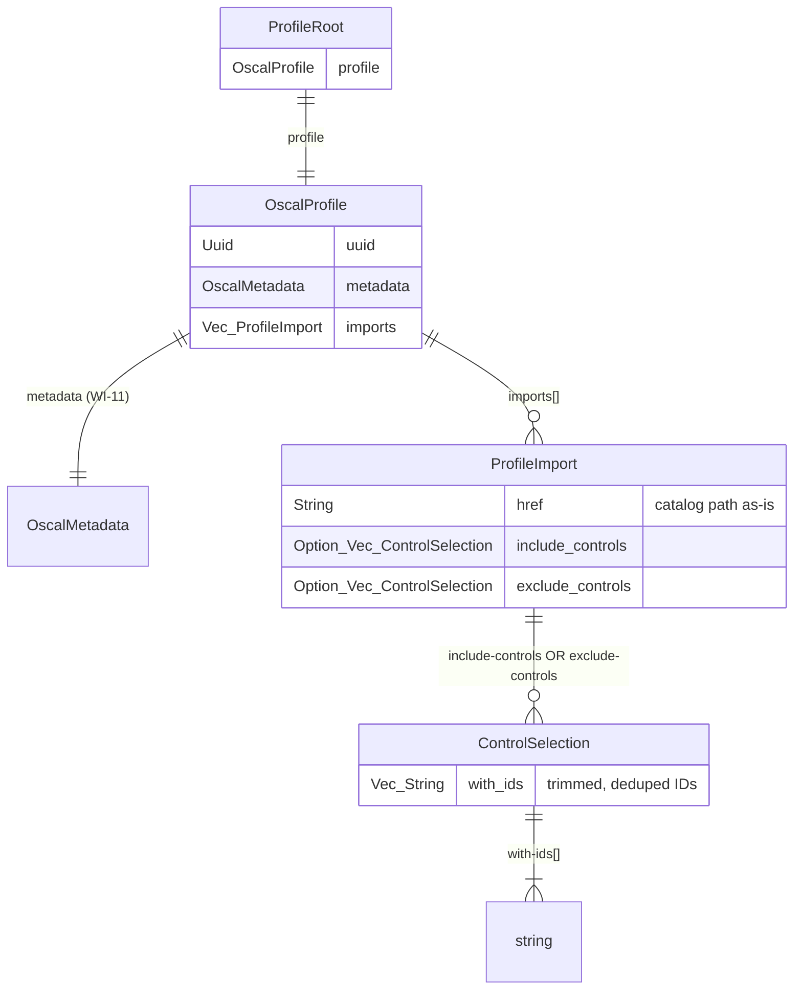

# Data Model: 030-prd-profile-generation

**Phase**: 1 — Design
**Status**: Complete

---

## Entity Overview

```
ProfileRoot
└── OscalProfile
    ├── uuid: String (UUID v4)
    ├── metadata: OscalMetadata (from WI-11)
    └── imports: Vec<ProfileImport>
        └── ProfileImport
            ├── href: String (catalog path, as-is from --catalog)
            ├── include_controls: Option<Vec<ControlSelection>>
            └── exclude_controls: Option<Vec<ControlSelection>>
                └── ControlSelection
                    └── with_ids: Vec<String>
```

---

## Struct Definitions

### ProfileRoot

Root wrapper for OSCAL Profile JSON serialization. Produces `{"profile": {...}}`.

| Field | Type | Serde | Description |
|-------|------|-------|-------------|
| `profile` | `OscalProfile` | default | OSCAL Profile payload |

---

### OscalProfile

The OSCAL Profile model. Directly serializes to the inner object of `{"profile": {...}}`.

| Field | Type | Serde | Description |
|-------|------|-------|-------------|
| `uuid` | `Uuid` | default | UUID v4, unique per generation |
| `metadata` | `OscalMetadata` | default | Metadata from WI-11 `assemble_metadata` |
| `imports` | `Vec<ProfileImport>` | default | Import entries (WI-30: exactly one) |

**Validation rules:**
- `imports` must be non-empty (enforced by construction, always 1 element in WI-30)
- `uuid` is generated as UUID v4 via `Uuid::new_v4()`

---

### ProfileImport

A single entry in the `imports[]` array, referencing a source Catalog and specifying control selection.

| Field | Type | Serde | Description |
|-------|------|-------|-------------|
| `href` | `String` | default | Catalog path as provided by `--catalog` (no normalization) |
| `include_controls` | `Option<Vec<ControlSelection>>` | rename=`include-controls`, skip_serializing_if=None | Present when `--include` used |
| `exclude_controls` | `Option<Vec<ControlSelection>>` | rename=`exclude-controls`, skip_serializing_if=None | Present when `--exclude` used |

**Invariant**: Exactly one of `include_controls` or `exclude_controls` is `Some(_)`. The other is `None`. This is enforced by `SelectionMode` in `build_profile`.

---

### ControlSelection

A selection specification with a list of control IDs.

| Field | Type | Serde | Description |
|-------|------|-------|-------------|
| `with_ids` | `Vec<String>` | rename=`with-ids` | Control IDs to include or exclude |

**Validation rules:**
- `with_ids` must be non-empty (empty IDs rejected at CLI arg parsing)
- IDs are trimmed of whitespace
- Duplicates are removed (order-preserving)

---

### SelectionMode (enum)

Internal enum used by `build_profile` to determine which `ProfileImport` field to populate.

```rust
pub enum SelectionMode {
    Include,
    Exclude,
}
```

Not serialized — used only during construction.

---

## State Transitions

Profile generation is single-pass — no state machine needed. The construction flow is:

```
CLI args → parse_control_ids() → SelectionMode → build_profile() → OscalProfile → ProfileRoot → JSON
```

---

## Relationship to WI-11 OscalMetadata

`OscalProfile.metadata` is the existing `OscalMetadata` struct from WI-11. No changes to that struct. Profile generation creates a `DocumentMetadata` with:

```rust
DocumentMetadata {
    title: "Policy Baseline Profile".to_string(),
    version: "1.0.0".to_string(),
    ..Default::default()
}
```

and passes it to `assemble_metadata(&doc_meta, None)`.

---

## ER Diagram


