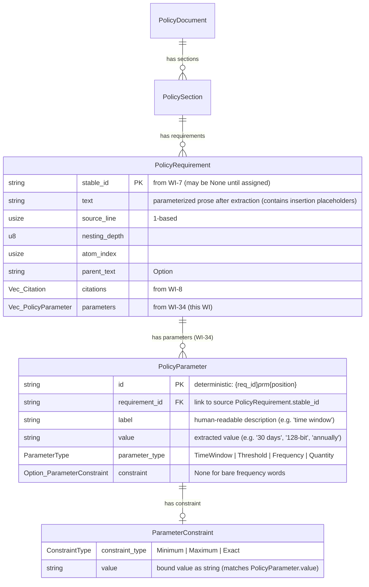

# Data Model: WI-34 Parameter Extraction

**Date**: 2026-02-17 | **Phase**: 1 — Design

---

## Entity Relationship Diagram



---

## Domain Types (new — `src/model/mod.rs`)

### `PolicyParameter`

```rust
/// A parameterizable value extracted from a policy requirement (WI-34).
///
/// Represents a configurable criterion (time window, threshold, frequency,
/// or quantity) extracted from requirement prose. Linked to its source
/// `PolicyRequirement` via `requirement_id`.
#[derive(Debug, Clone, PartialEq, Serialize)]
pub struct PolicyParameter {
    /// Deterministic identifier: `"{requirement_id}_prm_{position}"`.
    /// Example: `"POL-AC-001_prm_0"`
    pub id: String,

    /// `stable_id` of the `PolicyRequirement` this parameter was extracted from.
    pub requirement_id: String,

    /// Human-readable label (e.g., `"password change time window"`, `"minimum key length"`).
    pub label: String,

    /// Extracted parameter value as a string (e.g., `"30 days"`, `"128-bit"`, `"annually"`).
    pub value: String,

    /// Semantic category of this parameter.
    pub parameter_type: ParameterType,

    /// Value domain constraint inferred from qualifier words.
    /// `None` only for bare frequency words without a qualifier.
    pub constraint: Option<ParameterConstraint>,
}
```

### `ParameterType`

```rust
/// Semantic category of a policy parameter.
#[derive(Debug, Clone, PartialEq, Eq, Serialize)]
pub enum ParameterType {
    /// Duration parameters: "within 30 days", "after 6 months", "every 2 years"
    TimeWindow,
    /// Numeric boundary parameters: "at least 128-bit", "minimum 12 characters", "no more than 15 minutes"
    Threshold,
    /// Recurrence parameters: "annually", "quarterly", "at least monthly"
    Frequency,
    /// Count parameters: "no fewer than 3 factors", "at least 2 generations"
    Quantity,
}
```

### `ParameterConstraint`

```rust
/// Value domain constraint for a `PolicyParameter`.
///
/// Maps to an OSCAL `param.constraint` element.
#[derive(Debug, Clone, PartialEq, Serialize)]
pub struct ParameterConstraint {
    /// The type of bound.
    pub constraint_type: ConstraintType,
    /// The bound value (same as `PolicyParameter.value`).
    pub value: String,
}
```

### `ConstraintType`

```rust
/// The direction of a value domain bound.
#[derive(Debug, Clone, PartialEq, Eq, Serialize)]
pub enum ConstraintType {
    /// Value must be at least this (e.g., "at least", "minimum", "no fewer than").
    Minimum,
    /// Value must be at most this (e.g., "no more than", "maximum", "at most").
    Maximum,
    /// Value must equal exactly this (bare values, "every N", bare frequency words).
    Exact,
}
```

---

## Modified Domain Types (`src/model/mod.rs`)

### `PolicyRequirement` — new `parameters` field

```rust
pub struct PolicyRequirement {
    pub stable_id: Option<String>,       // from WI-7
    pub text: String,                    // MODIFIED: contains insertion placeholders after WI-34
    pub source_line: usize,
    pub nesting_depth: u8,
    pub atom_index: usize,
    pub parent_text: Option<String>,
    pub citations: Vec<Citation>,        // from WI-8
    pub parameters: Vec<PolicyParameter>, // NEW: populated by WI-34; empty until enrichment runs
}
```

**Impact on existing tests**: All `PolicyRequirement` struct literals in tests must add `parameters: vec![]`. Affects:
- `src/model/mod.rs` tests (sample_requirement helper)
- Any integration tests constructing `PolicyRequirement` directly

---

## Internal Extraction Types (`src/parameter/matchers.rs`)

These are crate-private and not exposed in the public API.

### `ParameterMatch`

```rust
/// Intermediate extraction result produced by a `ParameterMatcher`.
/// Carries byte offsets for span-based replacement.
#[derive(Debug)]
pub(crate) struct ParameterMatch {
    /// Start byte offset in the source text (inclusive).
    pub start: usize,
    /// End byte offset in the source text (exclusive).
    pub end: usize,
    /// The matched text span (for verification and debugging).
    pub matched_text: String,
    /// The extracted parameter value (e.g., "30 days", "128-bit").
    pub value: String,
    /// Semantic category.
    pub parameter_type: ParameterType,
    /// Human-readable label for the parameter.
    pub label: String,
    /// Inferred constraint, if any.
    pub constraint: Option<ParameterConstraint>,
}
```

### `ParameterMatcher` trait

```rust
/// Common interface for type-specific parameter matchers.
pub(crate) trait ParameterMatcher {
    /// Find all parameter matches in the given requirement text.
    ///
    /// Returns zero or more `ParameterMatch` objects. Matches may overlap
    /// if multiple matchers detect overlapping spans — orchestration layer
    /// resolves overlaps.
    fn find_parameters(&self, text: &str) -> Vec<ParameterMatch>;
}
```

---

## OSCAL Output Types (new — `src/oscal/catalog.rs`)

### `OscalParam`

```rust
/// OSCAL `param` element within a catalog control.
///
/// Conforms to OSCAL v1.2.0 Catalog schema:
/// catalog.groups[].controls[].params[].
#[derive(Debug, Clone, Serialize, Deserialize)]
pub struct OscalParam {
    /// Unique parameter identifier (e.g., `"POL-AC-001_prm_0"`).
    pub id: String,

    /// Human-readable label.
    pub label: String,

    /// Parameter values (OSCAL uses array for multi-value support).
    /// Typically one element for extracted parameters.
    #[serde(default, skip_serializing_if = "Vec::is_empty")]
    pub values: Vec<String>,

    /// Value domain constraints.
    #[serde(default, skip_serializing_if = "Vec::is_empty")]
    pub constraints: Vec<OscalParamConstraint>,
}
```

### `OscalParamConstraint`

```rust
/// OSCAL `param.constraint` element.
#[derive(Debug, Clone, Serialize, Deserialize)]
pub struct OscalParamConstraint {
    /// Human-readable description of the constraint
    /// (e.g., `"minimum: 30 days"`, `"maximum: 15 minutes"`, `"exact: annually"`).
    pub description: String,
}
```

### `OscalControl` — new `params` field

```rust
pub struct OscalControl {
    pub id: String,
    #[serde(skip_serializing, default)]
    pub uuid: String,
    pub title: String,
    #[serde(default, skip_serializing_if = "Vec::is_empty")]
    pub links: Vec<crate::oscal::back_matter::OscalLink>,
    #[serde(default)]
    pub parts: Vec<OscalPart>,
    #[serde(default, skip_serializing_if = "Vec::is_empty")]
    pub props: Vec<OscalProp>,
    /// OSCAL param elements (WI-34). Omitted from JSON when empty.
    #[serde(default, skip_serializing_if = "Vec::is_empty")]
    pub params: Vec<OscalParam>,   // NEW
}
```

**OSCAL schema note**: The OSCAL v1.2.0 catalog JSON schema places `params` before `parts` in control object. Serialization order via `serde` follows struct field order — `params` must be declared before `parts` in the struct, or use `#[serde(rename_all)]` ordering. Verify with schema validation post-implementation.

---

## Constraint Description Format

```
ConstraintType::Minimum → "minimum: {value}"
ConstraintType::Maximum → "maximum: {value}"
ConstraintType::Exact   → "exact: {value}"
```

Example: `PolicyParameter { value: "30 days", constraint: Some(ParameterConstraint { constraint_type: Minimum, value: "30 days" }) }` → `OscalParamConstraint { description: "minimum: 30 days" }`

---

## Label Generation Strategy

Labels are generated from parameter type and value:

| ParameterType | Label Pattern | Example |
|--------------|---------------|---------|
| TimeWindow | `"{qualifier} {value}"` | `"within 30 days"` |
| Threshold | `"{qualifier} {value}"` | `"at least 128-bit"` |
| Frequency | `"{value} frequency"` | `"annually frequency"` |
| Quantity | `"{qualifier} {value} {unit}"` | `"no fewer than 3 factors"` |

The label is the human-readable version of the matched text span, normalized to lowercase.

---

## State Transitions

```
PolicyRequirement (empty parameters Vec)
    ↓ extract_parameters() [WI-34]
PolicyRequirement (parameters populated, text updated with placeholders)
    ↓ build_catalog() [WI-9/WI-13]
OscalControl (params emitted from requirement.parameters)
```
